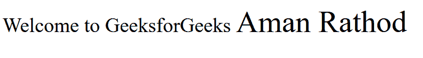

# 如何改变 HTML 中的字体大小？

> 原文:[https://www . geesforgeks . org/如何更改 html 中的字体大小/](https://www.geeksforgeeks.org/how-to-change-the-font-size-in-html/)

在本文中，我们将学习如何改变 HTML 中的字体大小。这可用于文本因其重要性而必须突出显示或标题变小的情况。这可以通过以下方法实现。

**方法 1:**HTML 中的 **[<字体>](https://www.geeksforgeeks.org/html-font-tag/#:~:text=HTML%20%7C%20Tag,-Difficulty%20Level%20%3A%20Basic&text=The%20tag%20plays%20an,same%20size%2C%20color%20and%20face.)** 标签可用于更改包含在标签中的字体。它有各种属性，可以用来指定字体的大小、颜色或字体。HTML5 中不推荐使用这个标签，因此这种方法在现代浏览器中可能无法使用。

**语法:**

```html
<font size="24">Your Text</font>
```

**示例:**

## 超文本标记语言

```html
<html>
<body>
  <!-- Using <font> tag to set font size -->
  <font size="6">
    Welcome to GeeksforGeeks
  </font>
  <font size="24">
    Aman Rathod
  </font>
</body>
</html>
```

**输出:**



**方法 2:**HTML 中的 **[<【大】>](https://www.geeksforgeeks.org/html-big-tag/#:~:text=The%20tag%20in%20HTML,can%20be%20used%20by%20CSS.)** 标签可用于将标签内的字体大小增加一级。它没有任何属性。HTML5 中不推荐使用这个标签，因此这种方法在现代浏览器中可能无法使用。

**语法:**

```html
<big>Your Text</big>
```

**示例:**

## 超文本标记语言

```html
<html>
<body>

<p>
    <!-- Using the <big> tag for increasing
    the font size -->
    Welcome to <big>GeeksforGeeks</big>
  </p>

</body>
</html>
```

**输出:**


**方法 3:** 使用**内联样式属性**更改其使用的标签的 **[字号](https://www.geeksforgeeks.org/css-font-size-property/)** 。该属性的使用会覆盖全局设置的任何样式。

**语法:**

```html
<p style="font-size: 24px;">Your Text</p>
```

**示例:**

## 超文本标记语言

```html
<html>
<body>
  <!--- Using Inline style
  attribute to edit font size -->
  <p style="font-size:20px">
    GeeksforGeeks
  </p>

  <p style="font-size:25px">
    Courses
  </p>

</body>
</html>
```

**输出:**


**方法 4:** 使用单独的 **CSS** 选择所需文本，并使用**字号**属性更改字号。可以使用长度单位或关键字(如 x-small、small 或 large)来设置大小值。

**语法:**

```html
<style>
p
{
  font-size: large;
}
</style>
```

**示例:**

## 超文本标记语言

```html
<html>
<head>

  <!-- Using CSS to change
  the font size -->
  <style>
    body {  
      font-size: 60px;
    }

    p {
      font-size:xx-large;
    }  
  </style>  
</head>
<body>
  Perfect Portal for Geeky

<p>Welcome to GeeksforGeeks</p>

</body>
</html>
```

**输出:**

