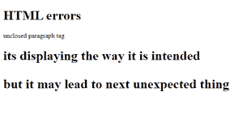
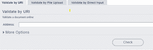
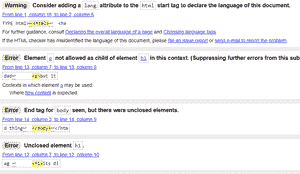

# 如何检查 HTML 中的错误？

> 原文:[https://www . geesforgeks . org/如何检查 html 中的错误/](https://www.geeksforgeeks.org/how-to-check-for-errors-in-html/)

HTML5 很容易理解，在浏览器显示之前不会编译成不同的形式。

在任何代码中，都可能出现两种类型的错误:

1.  **语法错误:**在其他 languages.HTML 导致编译时错误的不正确语法不受语法错误的影响。
2.  **逻辑错误:**语法正确，但由于逻辑错误，输出意外。

在超文本标记语言中，我们从来不会遇到语法错误，因为浏览器可以自由解析超文本标记语言，这意味着即使有任何语法错误，页面也会显示出来。浏览器有一些内置的规则来显示不正确的 HTML。因此，总会有一些产出，即使不是预期的。

浏览器解析 HTML 的方式比其他编程语言的运行方式宽松得多，这导致了好的(内容被显示)和坏的场景(内容以意想不到的方式显示)。

在下面的例子中，有一些语法错误，如不完整的 p 标签，不完整的 h1 标签，但它仍然以预期的方式显示一些内容。在这种情况下，初始 p 标签和 h1 标签，但下一个 p 标签显示为 h1。这些场景在小代码中很容易识别和避免，但是当代码长度增加时，调试代码将变得复杂。

**示例:**

## 超文本标记语言

```html
<!DOCTYPE html>
<html>

<head>
    <title>HTML errors</title>
</head>

<body>
    <h1>HTML errors</h1>
    <p>unclosed paragraph tag 
    <h1>its displaying the way it is intended
    <p>but it may lead to next unexpected thing
</body>

</html>
```

**输出:**



**验证我们的 HTML:** 为了确保您的 HTML 代码没有错误，w3c 使用了 [html 验证服务](https://validator.w3.org/)。该网站将 html 作为输入，并返回 html 文档中的错误。您可以通过提供 html 文档链接、上传 html 文件或直接在那里粘贴 html 来提供 html。



W3C 接口

**例:**我们直接贴 html 试试。这是上面给出的代码的结果。html 中的错误被突出显示，所以现在我们可以在 HTML 中进行相应的更改，使其没有错误。



错误

无错误的 HTML 如下所示。

## 超文本标记语言

```html
<!DOCTYPE html>
<html>
<head>
    <title>Page Title</title>
</head>
<body>
    <h2>Welcome To GFG</h2>
    <p>Default code has been loaded into the Editor.</p>
</body>
</html>
```