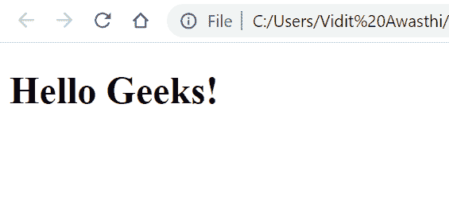

# 如何配置 emacs 来编辑包含 JavaScript 的 HTML 文件？

> 原文:[https://www . geesforgeks . org/如何配置-emacs-for-editing-html-file-the-contain-JavaScript/](https://www.geeksforgeeks.org/how-to-configure-emacs-for-editing-html-files-that-contain-javascript/)

有两种最好和最简单的方法来配置 emacs 来编辑包含 JavaScript 的 HTML 文件。

1.  **使用多网模式**
2.  **使用网络模式 el**

这两种方法都是最适合配置 emacs 来编辑 HTML 文件的方法，这些文件不仅包含 JavaScript，还可以用于包含 CSS、PHP 和 JSP 的 HTML 文件。只需要将一些代码片段粘贴到主文件中，工作就会完成。

**使用多网模式:**配置 emacs 是一种非常简单易行的方式。人们只需要在他们的。emac 文件如下所示:

```html
(require 'multi-web-mode)
(setq mweb-default-major-mode 'html-mode)
(setq mweb-tags 
  '((js-mode  "<script[^>]*>" "</script>")
    (css-mode "<style[^>]*>" "</style>")))
(setq mweb-filename-extensions '("htm" "html" "phtml"))
(multi-web-global-mode 1)
```

**注意:**同样，如果你想配置 emacs 来编辑包含其他语言的 HTML 文件，比如 PHP，你可以简单地在“setq mweb-tags”中包含 PHP 标签描述。

**多网模式:**下面是简单的安装步骤。打开你的。emacs 文件，并在那里添加下面的代码。

```html
(require 'multi-web-mode)
(setq mweb-default-major-mode 'html-mode)
(setq mweb-tags 
  '((php-mode "<\\?php\\|<\\? \\|<\\?=" "\\?>")
    (js-mode  "<script[^>]*>" "</script>")
    (css-mode "<style[^>]*>" "</style>")))
(setq mweb-filename-extensions '("php" "htm" "html" "ctp" 
                                 "phtml" "php4" "php5"))
(multi-web-global-mode 1) 
```

此外，如果我们谈论多网页模式的使用，那么它基本上绑定了以下击键:

1.  **M- < f11 > :** 此笔画提示用户覆盖默认主模式。
2.  **M- < f12 > :** 此笔划提示用户覆盖计算的额外缩进。

这就是我们如何配置 Emacs 来编辑包含 JavaScript 的 HTML 文件。

**使用 web-mode-el:** 这种配置 emacs 的方式最简单也最容易。我们可以使用主要模式“web-mode.el”来实现这种用途，在这种情况下，我们希望编辑包含 JavaScript、CSS、JAVA(JSP)、PHP 的 HTML 文件。“Web-mode.el”突出显示语法，并根据块的类型进行缩进。

**网络模式 el:** 可以通过以下方式使用:

```html
(require 'web-mode)
(add-to-list 'auto-mode-alist '("\\.html{content}quot; . web-mode))
```

**示例:**下面给出的示例显示了网络模式 el 的使用。在这段代码中，我们使用了 HTML、JavaScript、CSS、PHP。

## 超文本标记语言

```html
<!DOCTYPE html>
<html>
  <head>
    <meta charset="utf-8" />
    <style>
      H1 {
      }
      color: #0a @;
    </style>
    <script type="text/html">
      <span></span>
    </script>
    <?php
        // TODO
        $s = "a $var in a string":
    ?>
  </head>
  <body
    readonly
    class="wrapper"
    style="width: 100%"
    data-value="l"
    ng-init="count=8"
  >
    <h1>Hello Geeks!</h1>
    <core-icon></core-icon>
    <?php if ($x): ?>
    <span></span>
    <?php endif; ?>
  </body>
</html>
```

**输出:**下面是相同的输出。



简单输出网页。

因此，我们可以看到我们的代码已经智能缩进，并且与许多语言兼容。因此，这是配置 emacs 以编辑包含 JavaScript 的 HTML 文件的两种最好和最简单的方法。

**参考:**T2**https://web-mode.org/**T5】