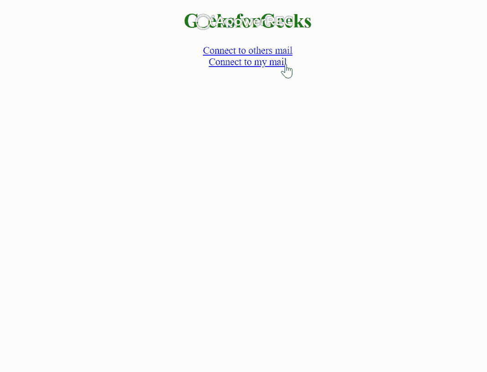
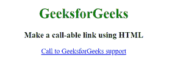
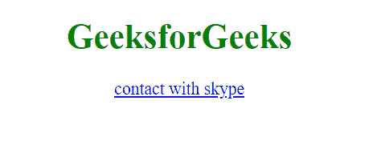

# 如何使用 HTML 连接 Skype、邮件和电话？

> 原文:[https://www . geeksforgeeks . org/如何使用 html 连接 Skype-邮件和电话/](https://www.geeksforgeeks.org/how-to-connect-skype-mail-and-phone-using-html/)

**连接邮件:** **Mailto** 链接是当消费者想要沟通或者想要给出反馈时发送邮件的默认方式，那么通过点击 **mailto** 链接会打开一个默认的发送邮件窗口。因此，我们可以使用**邮件到**，一旦提交表单，邮件就会直接发送到该邮件。使用 **mailto** 我们可以设置表单的动作字段，在这种情况下，web 浏览器调用电子邮件客户端将表单提交发送到指定的电子邮件地址。此外，我们还可以附上抄送、密件抄送、主题和正文内容。

**语法:**

```html
<form  method="POST" action="mailto: name@gmail.com"
          enctype="multipart/form-data">
```

**示例:**

## 超文本标记语言

```html
<!DOCTYPE html>
<html>

<body style="text-align: center;">
    <h1 style="color:green;">
        GeeksforGeeks
    </h1>

    <!-- Connecting to mail -->
    <a href="mailto:gfg@geeksforgeeks.org">
        Connect to others mail
    </a><br>

    <!-- Connecting to my mail -->
    <a href="mailto:geeks8@gfg.com">
        Connect to my mail
    </a>
</body>

</html>
```

**输出:**



**连接电话:**随着手机上网的兴起，直接从网页打电话的好处变得更加现实。使用超文本标记语言很容易建立一个可调用的链接。HTML 为浏览器提供了协议，如**电话**，用于添加可点击的电话号码。每个浏览器对这些协议的响应都不一样。有些人用显示屏上的号码启动手机应用，等你打电话，而有些人直接打电话。

**进场:**

*   在锚标签的 href 属性中添加电话:(一个号码)。
*   您甚至可以添加国际电话的国家代码作为号码的一部分。
*   有些电话号码有分机。您可以在分机前添加 p，这会在拨打下一部电话前造成一秒钟的延迟。

**语法:**

```html
<a href="tel:(countrycode)(NUMBER)p(extension)"> Text </a>
```

**示例:**

## 超文本标记语言

```html
<!DOCTYPE html>
<html>

<body style="text-align: center;">
    <h1 style="color: green;">
        GeeksforGeeks
    </h1>

    <h3>
        Make a call-able link using HTML
    </h3>

    <a href="tel:987654321">
        Call to GeeksforGeeks support
    </a>
</body>

</html>
```

**输出:**



**连接 Skype:** Skype 是一种电信应用，在手机、电脑和其他设备之间提供视频通话和语音通话。提供任何服务都需要互联网设施。它还用于包含文本、图像、音频或视频的消息传递。它允许在视频会议通话中同时连接几个人。2003 年由**Skype Technologies**推出。目前归 **微软公司** 所有。它是视频聊天最常用的应用之一。

**语法:**

```html
<a href="skype:cid.5728887e6ec8a357"> Connect with Skype </a>
```

**示例:**

## 超文本标记语言

```html
<!DOCTYPE html>
<html>

<body style="text-align: center;">
    <h1 style="color:green;">
        GeeksforGeeks
    </h1>

    <!-- Connecting to other's skype -->
    <a href="skype:cid.5728887e6ec8a357">
        contact with skype
    </a>
</body>

</html>
```

**输出:**

