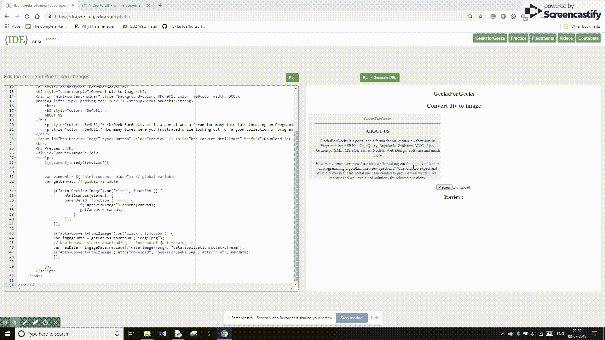

# 如何将一个 HTML 元素或文档转换成图像？

> 原文:[https://www . geesforgeks . org/如何将 html 元素或文档转换为图像/](https://www.geeksforgeeks.org/how-to-convert-an-html-element-or-document-into-image/)

本文将告诉并指导用户使用 AngularJS 将 div 元素转换成图像。用户将从网页生成图像，并且还能够将 HTML 页面的特定部分转换成图片。另外，用户需要一个 **HTML 标签**和 **html2canvas** JavaScript 库。通过使用这个，我们可以创建图片，即将网页转换成 PNG 或 JPEG 格式的图像。还将 ul、li 和所需的 **div** 标签处理为图像格式。总而言之，html2canvas 库会将 html 页面呈现为用户提到的首选图像格式。这意味着用户将能够创建 div 的截图或网页的任何元素。

**进场:**

*   网页中有两个按钮，一个用于预览网页图像，另一个用于下载网页图像。
*   使用 html2canvas JavaScript 库将 html 页面转换为图像。
*   当用户点击预览按钮时，调用 html2canvas()函数，该函数还调用另一个附加画布图像预览的函数。
*   当用户点击下载按钮时，首先将文档更改为图像格式，然后开始下载，而不是显示图像。

**示例:**

```html
<!DOCTYPE html>
<html>

<head>
    <title>
        How to convert an HTML element
        or document into image ?
    </title>

    <script src=
"https://ajax.googleapis.com/ajax/libs/jquery/1.11.2/jquery.min.js">
    </script>

    <script src=
"https://files.codepedia.info/files/uploads/iScripts/html2canvas.js">
    </script>
</head>

<body>
    <center>
    <h2 style="color:green">
        GeeksForGeeks
    </h2>

    <h2 style="color:purple">
        Convert div to image
    </h2>

    <div id="html-content-holder" style="background-color: #F0F0F1; 
                color: #00cc65; width: 500px;padding-left: 25px; 
                padding-top: 10px;">

        <strong>
            GeeksForGeeks
        </strong>

        <hr/>

        <h3 style="color: #3e4b51;">
            ABOUT US
        </h3>

        <p style="color: #3e4b51;"> 
            <b>GeeksForGeeks</b> is a portal and a forum
            for many tutorials focusing on Programming
            ASP.Net, C#, jQuery, AngularJs, Gridview, MVC,
            Ajax, Javascript, XML, MS SQL-Server, NodeJs,
            Web Design, Software and much more
        </p>

        <p style="color: #3e4b51;">
            How many times were you frustrated while 
            looking out for a good collection of 
            programming/algorithm/interview questions? 
            What did you expect and what did you get?
            This portal has been created to provide
            well written, well thought and well
            explained solutions for selected questions.
        </p>
    </div>

    <input id="btn-Preview-Image" type="button"
                value="Preview" /> 

    <a id="btn-Convert-Html2Image" href="#">
        Download
    </a>

    <br/>

    <h3>Preview :</h3>

    <div id="previewImage"></div>

    <script>
        $(document).ready(function() {

            // Global variable
            var element = $("#html-content-holder"); 

            // Global variable
            var getCanvas; 

            $("#btn-Preview-Image").on('click', function() {
                html2canvas(element, {
                    onrendered: function(canvas) {
                        $("#previewImage").append(canvas);
                        getCanvas = canvas;
                    }
                });
            });

            $("#btn-Convert-Html2Image").on('click', function() {
                var imgageData = 
                    getCanvas.toDataURL("image/png");

                // Now browser starts downloading 
                // it instead of just showing it
                var newData = imgageData.replace(
                /^data:image\/png/, "data:application/octet-stream");

                $("#btn-Convert-Html2Image").attr(
                "download", "GeeksForGeeks.png").attr(
                "href", newData);
            });
        });
    </script>
    </center>
</body>

</html>                    
```

**输出:**
