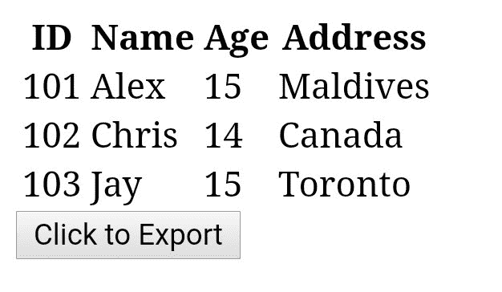

# 如何使用 jQuery 将 HTML 表格转换成 Excel 电子表格？

> 原文:[https://www . geeksforgeeks . org/如何使用-jquery/](https://www.geeksforgeeks.org/how-to-convert-html-table-into-excel-spreadsheet-using-jquery/) 将-html-table 转换为-excel-电子表格

您创建的任何 HTML 表格都可以使用 jQuery 转换为 Excel 电子表格，并且它与所有浏览器兼容。有两种简单的方法需要基本的 HTML 和 jQuery 知识来实现这一点。

*   **Approach 1: Using jQuery plugin:** A simple jQuery plugin ‘table2excel’ can be used for converting an HTML table to an excel sheet.

    **语法:**

    ```html
    $("#table-id").table2excel({
        filename: "excel_sheet-name.xls"
    });
    ```

    **示例:**

    ```html
    <table id="studtable">
        <tr>
            <th>ID</th>
            <th>Name</th>
            <th>Age</th>
            <th>Address</th>
        </tr>
        <tr>
            <td>101</td>
            <td>Alex</td>
            <td>15</td>
            <td>Maldives</td>
        </tr>
        <tr>
            <td>102</td>
            <td>Chris</td>
            <td>14</td>
            <td>Canada</td>
        </tr>

        <tr>
            <td>103</td>
            <td>Jay</td>
            <td>15</td>
            <td>Toronto</td>
        </tr>

    </table>

    <script>

     $(document).ready(function () {
        $("#studtable").table2excel({
            filename: "Students.xls"
        });
     });

    </script>
    ```

    **输出:**

    ```html

    ID    Name    Age    Address
    101    Alex    15    Maldives
    102    Chris    14    Canada
    103    Jay    15    Toronto
    ```

    上述输出以与 HTML 表格完全相同的方式转换成 Excel 电子表格。

    **关于“表 2 excel”:***“表 2 Excel”*是一个简单而有用的 jQuery 插件，允许将 HTML 表数据导出到 Excel 文件。*“表格 2 excel”*还有一个排除包含指定类别的单元格的功能。

    **无导出语法:**

    ```html
    $(document).ready(function() {
        $("#table-id").table2excel({
            exclude: ".noExport",
            filename: "name-of-the-file",
        });
    });
    ```

    **排除某些指定单元格的示例代码:**

    ```html
    <script src=
    "//ajax.googleapis.com/ajax/libs/jquery/2.2.4/jquery.min.js">
    </script>
    <script src=
    "//cdn.rawgit.com/rainabba/jquery-table2excel/1.1.0/dist/jquery.table2excel.min.js">
    </script>

    <button>Export</button>
    <table>
        <thead>
            <tr>
                <td class="noExport">
                    This cell will not be exported.
                </td>
                <td>
                    This cell will get exported.
                </td>
            </tr>
        </thead>
        <tbody>
            <tr>
                <td>Alex</td>
                <td class="noExport">Maldives</td>
            </tr>
            <tr>
                <td>Chris</td>
                <td>Canada</td>
            </tr>
        </tbody>
    </table>
    ```

    **注意:**
    *在上面的样例代码中，类**。noExport'** 已经被用来从 HTML 表格数据中排除那些指定的单元格。因此，导出的 Excel 电子表格也不包括 HTML 表格数据中的那些单元格。*

*   **Approach 2: Using simple HTML:** Consider the same students table above to understand the below. Let’s use a button in our code which when clicked to converts the HTML data table into an Excel spreadsheet.

    ***注意下面的‘导出’按钮实际上并没有把 HTML 表格转换成 excel 表格。这必须在一个适当的和已经存在的 HTML 代码中使用，以获得 Excel 电子表格，并且在这个集成开发环境中不起作用。**T3】*

    ```html
    <!DOCTYPE html>
    <html>

    <head>
        <title>
            HTML Table To Excel 
            spreadsheet using
            HTML only
        </title>
    </head>

    <body>
        <table id="studtable">
            <tr>
                <th>ID</th>
                <th>Name</th>
                <th>Age</th>
                <th>Address</th>
            </tr>
            <tr>
                <td>101</td>
                <td>Alex</td>
                <td>15</td>
                <td>Maldives</td>
            </tr>
            <tr>
                <td>102</td>
                <td>Chris</td>
                <td>14</td>
                <td>Canada</td>
            </tr>
            <tr>
                <td>103</td>
                <td>Jay</td>
                <td>15</td>
                <td>Toronto</td>
            </tr>
        </table>

        <button onclick="tableToExcel(
            'studtable', 'Students')">
            Click to Export
        </button>
    </body>

    </html>
    ```

    **输出:**
    

HTML 是网页的基础，通过构建网站和网络应用程序用于网页开发。您可以通过以下 [HTML 教程](https://www.geeksforgeeks.org/html-tutorials/)和 [HTML 示例](https://www.geeksforgeeks.org/html-examples/)从头开始学习 HTML。

CSS 是网页的基础，通过设计网站和网络应用程序用于网页开发。你可以通过以下 [CSS 教程](https://www.geeksforgeeks.org/css-tutorials/)和 [CSS 示例](https://www.geeksforgeeks.org/css-examples/)从头开始学习 CSS。

jQuery 是一个开源的 JavaScript 库，它简化了 HTML/CSS 文档之间的交互，它以其“少写多做”的理念而闻名。
跟随本 [jQuery 教程](https://www.geeksforgeeks.org/jquery-tutorials/)和 [jQuery 示例](https://www.geeksforgeeks.org/jquery-examples/)可以从头开始学习 jQuery。