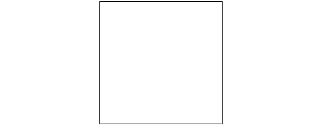

# 如何创建一个基本的空 HTML 画布？

> 原文:[https://www . geesforgeks . org/如何创建-基本-空-html-canvas/](https://www.geeksforgeeks.org/how-to-create-a-basic-empty-html-canvas/)

**HTML Canvas:**Canvas 是 HTML 中一个名为 [< canvas >](https://www.geeksforgeeks.org/html-canvas-tag/) 元素的元素，用于使用 JavaScript 绘制图形。它只是一个图形容器。您必须使用 JavaScript 来绘制图形，它有几种方法来绘制路径、框、圆、文本和添加图像。

画布是 HTML 页面上的矩形区域，默认情况下，画布没有边框和内容。

**语法:**

```html
<canvas>
    Content...
</canvas>
```

建议使用 id 属性(在脚本中引用)，宽度和高度属性来定义画布的大小。若要添加边框，请使用样式属性。

**示例:**下面的代码演示了空画布。

## 超文本标记语言

```html
<!DOCTYPE html>
<html>

<head>
    <style>
        body {
            text-align: center;
        }
    </style>
</head>

<body>
    <canvas id="myCanvas" width="300" height="300"
        style="border:1px solid #000000;">
        GfG
    </canvas>
</body>

</html>
```

**输出:**

