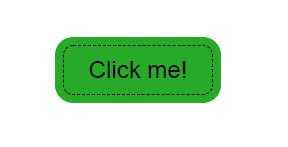

# 如何用 HTML 和 CSS 创建一个有缝合边框的按钮？

> 原文:[https://www . geeksforgeeks . org/如何使用 html 和 css 创建带缝合边框的按钮/](https://www.geeksforgeeks.org/how-to-create-a-button-with-stitched-border-using-html-and-css/)

我们可以使用简单的 HTML 和 CSS 为按钮提供缝合的边框，通常当我们创建网站时，我们希望它看起来更有吸引力，因此我们可以提供缝合的按钮来使我们的网站看起来更有创意。以下部分将指导您如何创建所需的按钮。

*   **HTML 代码:**在本节中，我们将使用*按钮类创建一个基本按钮。*

    ```html
    <!DOCTYPE html>
    <html lang="en" dir="ltr">
      <head>
        <meta charset="utf-8">
        <title>Stiched Button</title>
      </head>

      <body>
          <button>Click me!</button>
      </body>
    </html>
    ```

*   **CSS 代码:**在本节中，首先我们将使用基本的 CSS 属性设计按钮，然后为了创建缝合的边框，我们将使用 CSS *边框*属性并将边框设置为*虚线到*提供*T7】的*缝合*外观到我们的按钮。*

    ```html
    <style>
        body{
          margin: 0;
          padding: 0;
          background: white;
        }

        /* styling the button */
        button{
         position: absolute;
          top: 50%;
          left:  50%;
          transform: translate(-50%,-50%);
          border: 1px dashed black ;
          box-shadow: 0 0 0 8px rgb(39, 170, 39);
          background-color: rgb(39, 170, 39);
          height: 50px;
          width: 150px;
          font-size: 1.5em;
          border-radius: 10px;
        }

        </style>
    ```

**最终代码:**是以上两个代码段的组合。

```html
<!DOCTYPE html>
<html lang="en" dir="ltr">
  <head>
    <meta charset="utf-8">
    <title>Stiched Button</title>
  </head>
  <style>
    body{
      margin: 0;
      padding: 0;
      background: white;
    }

    /* styling the button */
    button{
     position: absolute;
      top: 50%;
      left:  50%;
      transform: translate(-50%,-50%);
      border: 1px dashed black ;
      box-shadow: 0 0 0 8px rgb(39, 170, 39);
      background-color: rgb(39, 170, 39);
      height: 50px;
      width: 150px;
      font-size: 1.5em;
      border-radius: 10px;
    }

    </style>

  <body>
      <button>Click me!</button>
  </body>
</html>
```

**输出:**

