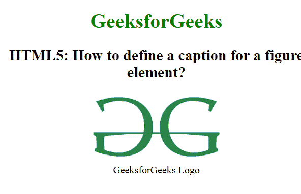

# 如何用 HTML5 创建图形元素的标题？

> 原文:[https://www . geeksforgeeks . org/如何使用 html5 创建图形元素标题/](https://www.geeksforgeeks.org/how-to-create-a-caption-for-a-figure-element-using-html5/)

在本文中，您将学习如何使用文档中的**[<【fig caption】>标签](https://www.geeksforgeeks.org/html5-figcaption-tag/)** 为图形元素创建标题。HTML5 页面中的这个新标签用于为文档中的图形元素设置标题。

**语法:**

```html
<figcaption> Figure caption </figcaption>
```

**示例:**以下示例演示了如何为 HTML 图形元素应用标题。

```html
<!DOCTYPE html>
<html>

<head>
    <title>
        How to define a caption 
        for a figure element?
    </title>

    <style>
        body {
            text-align: center;
        }

        h1 {
            color: green;
        }
    </style>
</head>

<body>
    <h1>GeeksforGeeks</h1>

    <h2>
        HTML5: How to define a 
        caption for a figure 
        element?
    </h2>

    <figure>
        

        <figcaption>
            GeeksforGeeks Logo
        </figcaption>
    </figure>
</body>

</html>                        
```

**输出:**


**支持的浏览器:**

*   谷歌 Chrome
*   微软公司出品的 web 浏览器
*   火狐浏览器
*   歌剧
*   旅行队