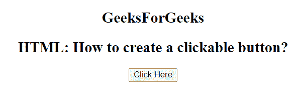

# 如何在 HTML 中创建一个可点击的按钮？

> 原文:[https://www . geesforgeks . org/如何创建可点击的 html 按钮/](https://www.geeksforgeeks.org/how-to-create-a-clickable-button-in-html/)

在本文中，我们将使用文档中的 **<按钮>** 元素创建一个按钮。
用于提交内容。图像和文本内容可以在**按钮内使用**标签。

**语法:**

```html
<button type = "button">
```

**示例:**使用 [HTML <按钮>类型属性](https://www.geeksforgeeks.org/html-button-type-attribute/)

```html
<!DOCTYPE html> 
<html> 
    <head> 
        <title>
            How to create a clickable button?
              </title> 
    </head> 

    <body> 
      <center>
        <p>
            <h2>
                GeeksForGeeks
        </h2>
        </p> 
        <h2>
            HTML: How to create a clickable button?

        </h2>

        <!-- button tag starts from here -->
        <button type = "button" onclick = 
            "alert('Welcome to GeeksforGeeks')"> 
            Click Here 
        </button> 
        <!-- button tag ends here -->

    </body> 
</html>                     
```

**输出:**


**支持的浏览器如下:**

*   谷歌 Chrome
*   微软公司出品的 web 浏览器
*   火狐浏览器
*   歌剧
*   旅行队