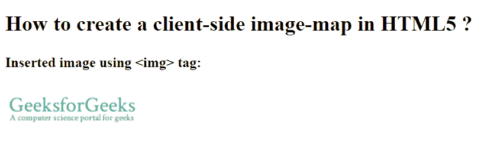

# 如何在 HTML5 中创建客户端图像映射？

> 原文:[https://www . geesforgeks . org/如何创建客户端-图像-地图-html5/](https://www.geeksforgeeks.org/how-to-create-a-client-side-image-map-in-html5/)

在本文中，我们将通过使用 **[< img >标签](https://www.geeksforgeeks.org/html-images/)** 来创建客户端图像地图。< img >标签用于在网页上添加图像。这个标记是一个空标记，这意味着它只能包含一个属性列表，并且没有结束标记。

**语法:**

```html

```

**示例:**

```html
<!DOCTYPE html>
<html>

<head>
    <title>
        Define a client-side
        image-map
    </title>
</head>

<body>
    <h2>
        HTML5: How to define a
        client-side image-map?
    </h2>

    <h4>
        Inserted image
        using  tag:
    </h4>
    
</body>

</html>
```

**输出:**


**支持的浏览器:**

*   谷歌 Chrome
*   微软公司出品的 web 浏览器
*   火狐浏览器
*   歌剧
*   旅行队