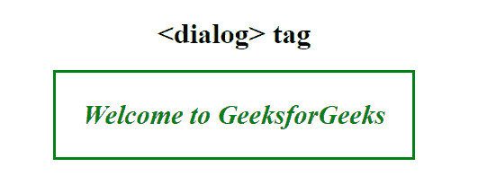
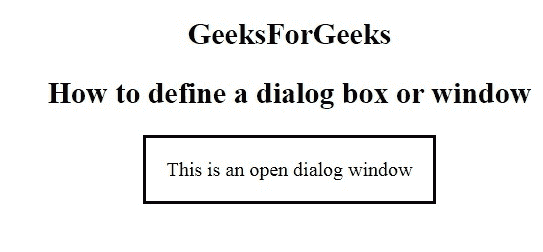

# 如何用 HTML 创建对话框或窗口？

> 原文:[https://www . geesforgeks . org/如何在 html 中创建对话框或窗口/](https://www.geeksforgeeks.org/how-to-create-a-dialog-box-or-window-in-html/)

在本文中，我们将使用文档中的 **[<对话框>标记](https://www.geeksforgeeks.org/html5-dialog-tag/)** 来创建一个对话框或窗口。该标签用于在网页上创建弹出对话框和模型。这个标签在 HTML5 中是新的。

**语法:**

```html
<dialog open> Contents... </dialog>
```

**例 1:**

```html
<!DOCTYPE html>
<html>

<head>
    <title>
        How to define a dialog 
        box or window?
    </title>

    <style>
        dialog {
            color: green;
            font-size: 30px;
            font-weight: bold;
            font-style: italic;
        }

        body {
            text-align: center;
        }
    </style>
</head>

<body>
    <h1>
        <dialog> tag
    </h1>
    <dialog open>
        Welcome to GeeksforGeeks
    </dialog>
</body>

</html>              
```

**输出:**


**例 2:**

```html
<!DOCTYPE html>
<html>

<head>
    <meta charset="utf-8">
    <title>
        How to define a dialog
        box or window?
    </title>

    <style>
        table,
        th,
        td {
            border: 1px solid red;
        }
    </style>
</head>

<body>
    <center>
        <h2>GeeksForGeeks</h2>
        <h2>
            How to define a 
            dialog box or window
        </h2>

        <dialog open>
            This is an open dialog window
        </dialog>
    </center>
</body>

</html>
```

**输出:**


**支持的浏览器如下:**

*   谷歌 Chrome
*   微软公司出品的 web 浏览器
*   火狐浏览器
*   歌剧
*   旅行队