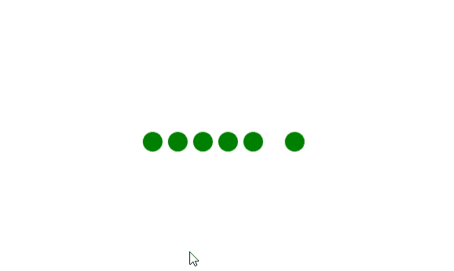

# 如何使用 HTML 和 CSS 创建点加载动画？

> 原文:[https://www . geesforgeks . org/如何使用 html 和 css 创建点加载动画/](https://www.geeksforgeeks.org/how-to-create-a-dot-loading-animation-using-html-and-css/)

点加载动画可以用来增强网站的用户界面，它可以在网站加载时添加。这个动画可以很容易地用 HTML 和 CSS 创建。

**HTML 代码:**在本节中，我们将使用一个 ***div*** 标签来创建点加载器的基本结构，该标签内部将有一些 ***span*** 标签。

```html
<!DOCTYPE html>
<html lang="en">
<head>
  <meta charset="UTF-8">
  <meta name="viewport"
        content="width=device-width,
                 initial-scale=1.0">
  <title>Dots Loading Animation</title>
</head>
<style>

<body>
  <div class="loader">
    <span></span>
    <span ></span>
    <span ></span>
    <span ></span>
    <span></span>
    <span></span>
  </div>
</body>
</html>
```

**CSS 代码:**在本节中，首先我们将使用一些基本的 CSS 属性创建点结构，然后为了创建动画，我们将使用***@关键帧*** 规则，并使用 ***transformX()*** 函数来产生所需的效果。

```html
<style>
body{
  margin: 0;
  padding: 0;
 }

 .loader{
   position: absolute;
   top: 50%;
   left: 50%;
   transform: translate(-50%, -50%);
   display: flex;
   align-items: center;

 }
 /* Creating the dots */
 span{
   height: 25px;
   width: 25px;
   margin-right: 10px;
   border-radius: 50%;
   background-color: green;
   animation: loading 1s linear infinite;
 }
 /* Creating the loading animation*/
 @keyframes loading {
   0%{
    transform: translateX(0);
   }
   25%{
    transform: translateX(15px);
   }
   50%{
    transform: translateX(-15px);
   }
   100%{
    transform: translateX(0);
   }

 }

span:nth-child(1){
  animation-delay: 0.1s;
}
span:nth-child(2){
  animation-delay: 0.2s;
}
span:nth-child(3){
  animation-delay: 0.3s;
}
span:nth-child(4){
  animation-delay: 0.4s;
}
span:nth-child(5){
  animation-delay: 0.5s;
}
</style>
```

**完整代码:**是以上两个代码段的组合。

```html
<!DOCTYPE html>
<html lang="en">
<head>
  <meta charset="UTF-8">
  <meta name="viewport" 
        content="width=device-width,
                 initial-scale=1.0">
  <title>Dots loading animation</title>
</head>
<style>
  body{
  margin: 0;
  padding: 0;
 }

 .loader{
   position: absolute;
   top: 50%;
   left: 50%;
   transform: translate(-50%, -50%);
   display: flex;
   align-items: center;

 }
 /* Creating the dots */
 span{
   height: 25px;
   width: 25px;
   margin-right: 10px;
   border-radius: 50%;
   background-color: green;
   animation: loading 1s linear infinite;
 }
 /* Creating the loading animation*/
 @keyframes loading {
   0%{
    transform: translateX(0);
   }
   25%{
    transform: translateX(15px);
   }
   50%{
    transform: translateX(-15px);
   }
   100%{
    transform: translateX(0);
   }

 }
span:nth-child(1){
  animation-delay: 0.1s;
}
span:nth-child(2){
  animation-delay: 0.2s;
}
span:nth-child(3){
  animation-delay: 0.3s;
}
span:nth-child(4){
  animation-delay: 0.4s;
}
span:nth-child(5){
  animation-delay: 0.5s;
}
</style> 
<body>
  <div class="loader">
    <span></span>
    <span ></span>
    <span ></span>
    <span ></span>
    <span></span>
    <span></span>
  </div>
</body>
</html>
```

**输出:**

