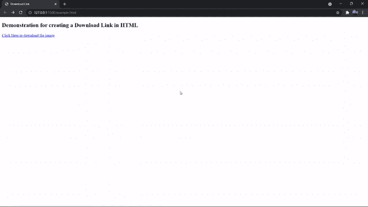

# 如何用 HTML 创建下载链接？

> 原文:[https://www . geeksforgeeks . org/如何创建带有 html 的下载链接/](https://www.geeksforgeeks.org/how-to-create-a-download-link-with-html/)

每天从网站上下载的东西太多了，我们甚至数不清这是不是超乎想象。但是作为一名程序员，你也应该知道为自己创建一个下载链接，这样当你需要把它添加到你的网站时，你就可以很容易地添加这个功能。在本文中，我们将学习如何使用 [html](https://www.geeksforgeeks.org/html-tutorials/) 创建下载链接。

**下载链接**是用户点击后会下载特定文件的链接。现在，让我们谈谈编写代码时将在代码中使用的属性。**“下载”**属性用于使链接可下载。它将指定目标(pdf、zip、jpg、doc 等)，只有当用户点击链接时才会下载。

**注意:**下载属性只能在之前设置了 href 属性的情况下使用。

**语法:**

```html
<a href="NameOfFile.extension" download></a>
```

**示例:**此示例描述了如何创建可下载的链接。

## 超文本标记语言

```html
<!DOCTYPE html>
<html>

<head>
    <title>Download Link</title>
</head>

<body>
    <h2>
        Demonstration for creating 
        a Download Link in HTML
    </h2>

    <!-- Using the <a> tag with href 
        and download attributes -->
    <a href="gfglogo.png" download>
        Click Here to download the image
    </a>
</body>

</html>
```

#### 输出:



**支持的浏览器:**

*   谷歌 Chrome
*   火狐浏览器
*   微软边缘
*   旅行队
*   歌剧