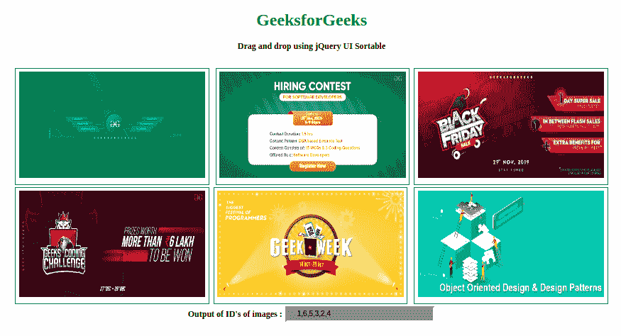

# 如何使用 HTML CSS 和 jQueryUI 创建一个拖放功能来重新排序图像？

> 原文:[https://www . geesforgeks . org/如何使用 html-css-and-jqueryui/](https://www.geeksforgeeks.org/how-to-create-a-drag-and-drop-feature-for-reordering-the-images-using-html-css-and-jqueryui/) 创建用于重新排序图像的拖放功能



给定一个图像库，任务是通过拖放来重新排列图像在列表或网格中的顺序。jQuery UI 框架提供了**可排序()功能**，通过使用鼠标帮助重新排序列表项。有了这个功能，列表项就可以互换了。jQuery UI 提供了一个带有默认可拖动属性的可排序()函数。HTML 文档中的所有列表元素都是可互换的，并且为了显示而重新排序。用户可以在鼠标的帮助下将元素拖放到新的位置。其他元素会自我调整以适应列表。

**创建结构:**在本节中，我们通常包括所需的 jQueryUI 链接和库。此外，我们将创建一个基本的图像库，在这里我们将执行拖放功能来重新排序图库列表。

*   **包括所有需要的 jQuery 和 jQuery UI 库:**

    > <link href="“https://code.jquery.com/ui/1.10.4/themes/ui-lightness/jquery-ui.css”" rel="“stylesheet”">
    > <脚本 src = " https://code。jquery。com/jquery-1。10 .2 .js " > < /脚本>
    > <脚本 src = " https://code。jquery。com/ui/1。10 .4/jquery-ui。js " > < /脚本>

*   **HTML 代码创建结构:**

    ```html
    <!DOCTYPE html>
    <html>
    <head>
        <title>
            How to create drag and drop
            features for images reorder
            using HTML CSS and jQueryUI?
        </title>
    </head>

    <body>
        <h1 style="color:green">GeeksforGeeks</h1> 

        <b>Drag and drop using jQuery UI Sortable</b>

        <div class="height"></div><br>

        <div id = "imageListId">
            <div id="imageNo1" class = "listitemClass">
                
            </div>

            <div id="imageNo2" class = "listitemClass">
                
            </div>

            <div id="imageNo3" class = "listitemClass">
                
            </div>

            <div id="imageNo4" class = "listitemClass">
                
            </div>

            <div id="imageNo5" class = "listitemClass">
                
            </div>

            <div id="imageNo6" class = "listitemClass">
                
            </div>
        </div>

        <div id="outputDiv">
            <b>Output of ID's of images : </b>
            <input id="outputvalues" type="text" value="" />
        </div>
    </body>

    </html>
    ```

**设计结构:**在本节中，我们将设计预先创建的结构，并通过添加 JavaScript 代码来添加拖放功能。

*   **CSS 代码设计结构:**

    ```html
    <style>

        /* text align for the body */
        body {
            text-align: center;
        }

        /* image dimension */
        img {
            height: 200px;
            width: 350px;
        }

        /* imagelistId styling */
        #imageListId {
            margin: 0;
            padding: 0;
            list-style-type: none;
        }

        #imageListId div {
            margin: 0 4px 4px 4px;
            padding: 0.4em;
            display: inline-block;
        }

        /* Output order styling */
        #outputvalues {
            margin: 0 2px 2px 2px;
            padding: 0.4em;
            padding-left: 1.5em;
            width: 250px;
            border: 2px solid dark-green;
            background: gray;
        }

        .listitemClass {
            border: 1px solid #006400;
            width: 350px;
        }

        .height {
            height: 10px;
        }
    </style>
    ```

*   **JS 代码添加功能:**

    ```html
    <script>
        $(function() {
            $("#imageListId").sortable({
                update: function(event, ui) {
                        getIdsOfImages();
                    } //end update         
            });
        });

        function getIdsOfImages() {
            var values = [];
            $('.listitemClass').each(function(index) {
                values.push($(this).attr("id")
                            .replace("imageNo", ""));
            });
            $('#outputvalues').val(values);
        } 
    </script>
    ```

**最终解决方案:**在本节中，我们将结合上述所有章节代码，并实现我们的任务，您可以执行拖放来重新排序图像库中的图像。

*   **程序:**

    ```html
    <!DOCTYPE html>
    <html>

    <head>
        <title>
            How to create drag and drop
            features for images reorder
            using HTML CSS and jQueryUI?
        </title>

        <link href = 
    "https://code.jquery.com/ui/1.10.4/themes/ui-lightness/jquery-ui.css"
                rel = "stylesheet">

        <script src = 
    "https://code.jquery.com/jquery-1.10.2.js">
        </script>

        <script src = 
    "https://code.jquery.com/ui/1.10.4/jquery-ui.js">
        </script>

        <style>

            /* text align for the body */
            body {
                text-align: center;
            }

            /* image dimension */
            img{
                height: 200px;
                width: 350px;
            }

            /* imagelistId styling */
            #imageListId
            { 
            margin: 0; 
            padding: 0;
            list-style-type: none;
            }
            #imageListId div
            { 
                margin: 0 4px 4px 4px;
                padding: 0.4em;             
                display: inline-block;
            }

            /* Output order styling */
            #outputvalues{
            margin: 0 2px 2px 2px;
            padding: 0.4em; 
            padding-left: 1.5em;
            width: 250px;
            border: 2px solid dark-green; 
            background : gray;
            }
            .listitemClass 
            {
                border: 1px solid #006400; 
                width: 350px;     
            }
            .height{ 
                height: 10px;
            }
        </style>

        <script>
            $(function() {
                $( "#imageListId" ).sortable({
                update: function(event, ui) {
                    getIdsOfImages();
                }//end update         
                });
            });

            function getIdsOfImages() {
                var values = [];
                $('.listitemClass').each(function (index) {
                    values.push($(this).attr("id")
                            .replace("imageNo", ""));
                });

                $('#outputvalues').val(values);
            }
        </script>
    </head>

    <body>
        <h1 style="color:green">GeeksforGeeks</h1>

        <b>Drag and drop using jQuery UI Sortable</b>

        <div class="height"></div><br>

        <div id = "imageListId">
            <div id="imageNo1" class = "listitemClass">
                
            </div>

            <div id="imageNo2" class = "listitemClass">
                
            </div>

            <div id="imageNo3" class = "listitemClass">
                
            </div>

            <div id="imageNo4" class = "listitemClass">
                
            </div>

            <div id="imageNo5" class = "listitemClass">
                
            </div>

            <div id="imageNo6" class = "listitemClass">
                
            </div>
        </div>

        <div id="outputDiv">
            <b>Output of ID's of images : </b>
            <input id="outputvalues" type="text" value="" />
        </div>
    </body>

    </html>
    ```

*   **输出:** 

jQuery 是一个开源的 JavaScript 库，它简化了 HTML/CSS 文档之间的交互，它以其“少写多做”的理念而闻名。
跟随本 [jQuery 教程](https://www.geeksforgeeks.org/jquery-tutorials/)和 [jQuery 示例](https://www.geeksforgeeks.org/jquery-examples/)可以从头开始学习 jQuery。