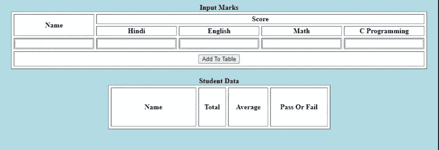

# 如何使用 HTML CSS 和 JavaScript 创建动态成绩单？

> 原文:[https://www . geesforgeks . org/如何使用 html-CSS-和-javascript 创建动态报告卡/](https://www.geeksforgeeks.org/how-to-create-a-dynamic-report-card-using-html-css-and-javascript/)

我们必须建立一个网站，在那里你可以上传你的学生数据，比如他们的名字，不同科目的分数。上传后，它还会将学生数据插入表中，并显示总分、平均分和及格/不及格状态。实现是使用 [HTML](https://www.geeksforgeeks.org/html-tutorials/) 和 [JavaScript](https://www.geeksforgeeks.org/javascript-tutorial/) 完成的。

**进场:**

*   首先，我们必须为姓名和科目分数创建一些行和列。同样，科目成绩将进一步分为四栏。将显示四个主题名称。允许用户点击“添加到表格”按钮输入详细信息。
*   将会有另一个表格*学生数据*，有四列名称，总计，平均，及格或不及格。
*   对于每一个输入的数据，都会在成绩表中增加一行，显示学生的总分、平均分和及格或不及格的状态。如果平均分数大于 70，则状态为“通过”，否则状态为“失败”。
*   如果我们输入另一个数据，它将存储在表中。

**示例:**

## 超文本标记语言

```html
<!DOCTYPE html>
<html>

<body bgcolor="lightblue">
    <center>
    <table border="1" cellspacing="5" bgcolor="white">
        <caption><b>Input Marks</b></caption>
        <tr>
            <th rowspan="2">Name</th>
            <th colspan="4">Score</th>

        </tr>
        <tr>
            <th>Hindi</th>
            <th>English</th>
            <th>Math</th>
            <th>C Programming</th>
        </tr>
        <tr>
            <td><input type="text" id="aname"></td>
            <td><input type="text" id="am"></td>
            <td><input type="text" id="aj"></td>
            <td><input type="text" id="ad"></td>
            <td><input type="text" id="an"></td>
        </tr>
        <tr>
            <th colspan="5" height="30">
            <input type="submit" value="Add To Table" onclick="Sub()"></th>
        </tr>    
    </table>
    <br>
    <table border="1" cellspacing="5" bgcolor="white" 
           height="100" width="500" cellpadding="5" id="TableScore">
        <caption><b>Student Data</b></caption>
        <tr>
            <th width="180">Name</th>
            <th>Total</th>
            <th>Average</th>
            <th>Pass Or Fail</th>
        </tr>

    </table>
    </center>
    <script type="text/javascript">
        function Sub(){
            var n, k, r, e, v, sum, avg;
            n=(document.getElementById('aname').value);
            k=parseFloat(document.getElementById('am').value);
            r=parseFloat(document.getElementById('aj').value);
            e=parseFloat(document.getElementById('ad').value);
            v=parseFloat(document.getElementById('an').value);
            // Calculating Total
            sum=k+r+e+v;
            avg=sum/4;
            // Display on Student Data
            var newTable = document.getElementById('TableScore');
            var row = newTable.insertRow(-1);
            var cell1 = row.insertCell(0);
            var cell2 = row.insertCell(0);
            var cell3 = row.insertCell(0);
            var cell4 = row.insertCell(0);

            cell4.innerHTML= n;
            cell3.innerHTML=sum;
            cell2.innerHTML = avg;

            if(avg>=70){
                cell1.innerHTML="<font color=green>Pass</font>";
            }else{
                cell1.innerHTML="<font color=red>Fail</font>";
            }
        }
    </script>
</body>
</html>
```

**输出:**



学生的及格或不及格状态