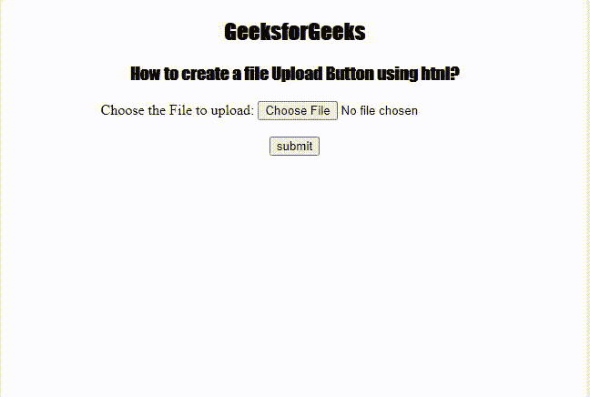

# 如何在 HTML 中创建文件上传按钮？

> 原文:[https://www . geesforgeks . org/如何创建文件-上传-按钮-在 html 中/](https://www.geeksforgeeks.org/how-to-create-a-file-upload-button-in-html/)

在本文中，我们将看到如何制作一个文件上传按钮来使用 HTML 上传文件。众所周知，上传文件是简单的 HTML 格式的一个重要方面。文件上传按钮用于上传用户照片或表单中的任何类型的文件。

**方法:**对于使用 HTML 上传文件，我们将

*   创建一个包含<input>标签的 HTML 文档。
*   使用设置为值“file”的 type 属性。

**语法:**

```html
<input type="file">
```

**示例:**

## 超文本标记语言

```html
<!DOCTYPE html>
<html>

<head>
    <title>HTML input type file</title>

    <!--CSS code-->
    <style>
        h1 {
            color: green;
        }

        h2,
        h3 {
            font-family: Impact;
        }

        body {
            text-align: center;
        }
    </style>
</head>

<body>
    <h2>GeeksforGeeks</h2>
    <h3>
        How to create a file Upload
        Button using html?
    </h3>

    <label> Choose the File to upload: </label>
    <input type="file" id="myFile" /> <br /><br />

    <input type="submit" value="submit" />
</body>

</html>
```

**输出:**可以看到文件上传后，按钮前会显示文件名称。



HTML 格式的文件上传按钮