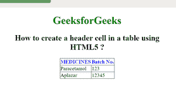

# 如何用 HTML5 在表格中创建表头单元格？

> 原文:[https://www . geeksforgeeks . org/如何使用-html5 创建表格中的标题单元格/](https://www.geeksforgeeks.org/how-to-create-a-header-cell-in-a-table-using-html5/)

在本文中，我们将在表格中创建一个标题单元格。本文的方法是在一个 HTML 表格中创建一个 Header 单元格。用于设置表格的表头单元格。标题单元格用于保存标题信息。

**语法:**

```html
<th> Contents... </th>
```

**示例:**

```html
<!DOCTYPE html>
<html>

<head>
   <style>
      body {
         text-align: center;
      }

      h1 {
         color: green;
      }

      th {
         color: blue;
      }

      table,
      tbody,
      td {
         border: 1px solid black;
         border-collapse: collapse;
         margin: 0 auto;
      }
   </style>
</head>

<body>
   <h1>GeeksforGeeks</h1>
   <h2>How to create a header cell
      in a table using HTML5 ?</h2>
   <table>
      <thead>
         <tr>
            <!-- th M starts here -->
            <th> MEDICINES</th>
            <th>Batch No.</th>
            <!-- th tag end here -->
         </tr>
      </thead>
      <tbody>
         <tr>
            <td>Paracetamol</td>
            <td>123</td>
         </tr>
         <tr>
            <td>Aplazar</td>
            <td>12345</td>
         </tr>
      </tbody>
   </table>
</body>

</html>                    
```

**输出:**



**支持的浏览器:**

*   谷歌 Chrome
*   微软公司出品的 web 浏览器
*   火狐浏览器
*   歌剧
*   旅行队