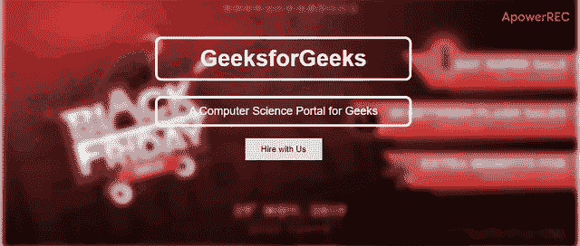

# 如何使用 HTML 和 CSS 创建英雄形象？

> 原文:[https://www . geesforgeks . org/如何使用 html 和 css 创建英雄形象/](https://www.geeksforgeeks.org/how-to-create-a-hero-image-using-html-and-css/)


英雄形象可以使用 HTML 和 CSS 设计。本文包含两个部分。第一节贴图设计基本结构。第二部分设计图像和图像上的文字。当你把英雄形象作为横幅时，它看起来很有吸引力。假设您想通知其他人您新添加的功能，那么使用这些功能将是最好的步骤。

**创建结构:**

在本节中，我们将为英雄形象封面图片创建基本结构。我们将附加图像，并将放置在图像上的文本放在下一部分。

*   **HTML 代码:**HTML 代码用于创建英雄形象的结构。因为它不包含 CSS，所以它只是一个简单的结构。我们将使用一些 CSS 属性使其具有吸引力。

## 超文本标记语言

```html
<!DOCTYPE html>
<html>

<head>
    <title>Create a hero image</title>
</head>

<body>
    <div class="container">

        <!-- background image -->
        

        <!-- title and tag line with button -->
        <div class="logo">

            <h1>GeeksforGeeks</h1>

<p>A Computer Science Portal for Geeks</p>

            <button>Hire with Us</button>
        </div>
    </div>
</body>

</html>
```

**设计结构:**

在前一节中，我们已经创建了基本网页的结构，现在我们将使用带有标题、标签和按钮的英雄图像。我们将在这一部分设计结构。

*   **CSS 代码:** CSS 代码是用来做一个吸引人的网站的。这个 CSS 属性是用来让英雄形象吸引眼球的。

## 超文本标记语言

```html
<style>

    /* blurring the image */
    .gfg {
        filter: blur(5px);
        width: 100%;
    }

    /* designing title and tag line */
    .logo {
        text-align:center;
        position: absolute;
        font-size: 18px;
        top: 50px;
        left: 27%;
        color: white;
    }
    h1, p {
        border: 4px solid white;
        padding: 10px 50px;
        position: relative;
        border-radius: 10px;
        font-family: Arial, Helvetica, sans-serif;
    }
    h1:hover {
        background: -webkit-linear-gradient( green, lime);
        -webkit-background-clip: text;
        -webkit-text-fill-color: transparent;
    }

    /* Designing button */
    .logo button {
        border: none;
        outline: 0;
        display: inline-block;
        padding: 10px 25px;
        color: black;
        background-color: #ddd;
        text-align: center;
        cursor: pointer
    }
    .logo button:hover {
        background-color: green;
        color: white;
    }
</style>
```

**结合 HTML 和 CSS 代码:**这个例子结合了 HTML 和 CSS 代码来设计英雄形象。

## 超文本标记语言

```html
<!DOCTYPE html>
<html>

<head>
    <title>Create a hero image</title>

    <style>

        /* blurring the image */
        .gfg {
            filter: blur(5px);
            width: 100%;
        }

        /* designing title and tag line */
        .logo {
            text-align:center;
            position: absolute;
            font-size: 18px;
            top: 50px;
            left: 27%;
            color: white;
        }
        h1, p {
            border: 4px solid white;
            padding: 10px 50px;
            position: relative;
            border-radius: 10px;
            font-family: Arial, Helvetica, sans-serif;
        }
        h1:hover {
            background: -webkit-linear-gradient( green, lime);
            -webkit-background-clip: text;
            -webkit-text-fill-color: transparent;
        }

        /* Designing button */
        .logo button {
            border: none;
            outline: 0;
            display: inline-block;
            padding: 10px 25px;
            color: black;
            background-color: #ddd;
            text-align: center;
            cursor: pointer
        }
        .logo button:hover {
            background-color: green;
            color: white;
        }
    </style>
</head>

<body>
    <div class="container">

        <!-- background image -->
        

        <!-- title and tag line with button -->
        <div class="logo">

            <h1>GeeksforGeeks</h1>

<p>A Computer Science Portal for Geeks</p>

            <button>Hire with Us</button>
        </div>
    </div>
</body>

</html>
```

**输出:**

