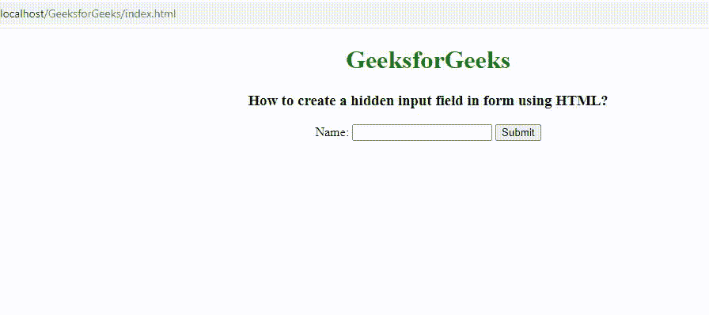

# 如何使用 HTML 在表单中创建隐藏的输入字段？

> 原文:[https://www . geesforgeks . org/如何使用 html 创建隐藏的表单输入字段/](https://www.geeksforgeeks.org/how-to-create-a-hidden-input-field-in-form-using-html/)

在本文中，我们将学习如何使用 [HTML](https://www.geeksforgeeks.org/html-tutorials/) 在表单中添加隐藏的输入字段。隐藏控件存储用户不可见的数据。它用于向服务器发送一些未经用户编辑的信息。通常，这个隐藏字段通常包含所有用户通用的值。该值必须记录在数据库中。

隐藏的输入字段通常包含那些在提交表单时需要在数据库中更新的值。

**进场:**

*   我们创建一个包含<input>标签的 HTML 文档。
*   使用 [*类型*](https://www.geeksforgeeks.org/html-input-type-attribute/) 属性配合 [<输入>](https://www.geeksforgeeks.org/html-input-tag/) 标记。
*   将*类型*属性设置为值“*隐藏*”。

**语法:**

```html
<input type="hidden">  
```

**示例:**在这段代码中，我们创建了一个隐藏字段，其中包含属于同一国家(即印度)的用户的记录。

## 超文本标记语言

```html
<!DOCTYPE html>
<html>

<head>
    <title>
        How to create a hidden input 
          field in form using HTML?
    </title>

    <style>
        h1 {
            color:green;
        }
        body {
            text-align:center;
        }
    </style>
</head>

<body>
    <h1>
        GeeksforGeeks
    </h1>    
    <h3>
        How to create a hidden input 
          field in form using HTML?
    </h3>

    <form action="#">
        <input type="hidden" name="country_name" 
            id="inputID" value="India" >

        Name: <input type="text">

        <input type="submit" value="Submit">
    </form>
</body>

</html>
```

**输出:**



隐藏输入字段