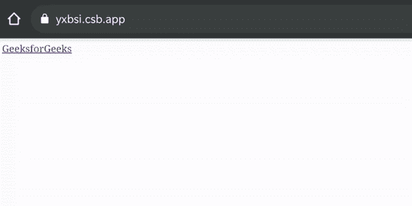

# 如何在 HTML5 中创建带有媒体属性的链接？

> 原文:[https://www . geeksforgeeks . org/如何用 html5 中的媒体属性创建链接/](https://www.geeksforgeeks.org/how-to-create-a-link-with-a-media-attribute-in-html5/)

[<链接>媒体属性](https://www.geeksforgeeks.org/html-link-media-attribute/)属性指定正在为目标资源优化哪个媒体/设备。该属性通常与 CSS 样式表结合使用，为各种媒体类型和连接到外部样式表指定不同的样式，允许用户为设备选择最合适的样式。

该属性接受多种值。它需要一个媒体类型/媒体查询作为它的值。

**语法:**

```html
<link media="value">
```

**操作员:**

*   **和:**它指定了一个“与”运算符
*   **not:** 它**T3】指定一个 not 运算符**
*   **，:**它指定了一个或运算符

**例 1:** 打印页面的打印预览模式使用“打印”值。

## 超文本标记语言

```html
<!DOCTYPE html>
<html>
  <body>
    <a href="https://www.geeksforgeeks.org/" media="print, handheld">
     GeeksforGeeks
    </a>
  </body>
</html>
```

**输出:**

