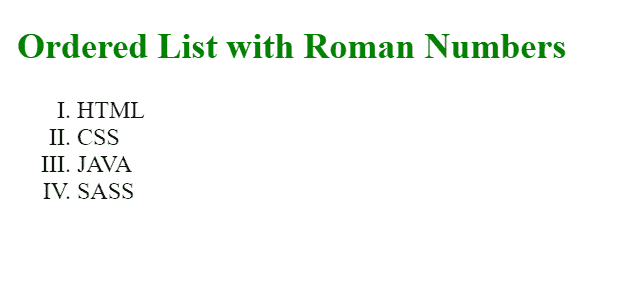
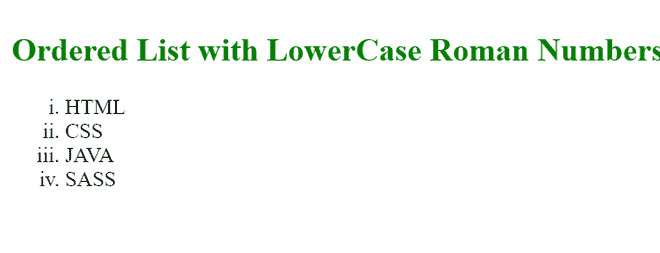

# 如何在 HTML 中创建带有罗马数字索引的列表？

> 原文:[https://www . geesforgeks . org/如何用 html 中的罗马数字索引创建列表/](https://www.geeksforgeeks.org/how-to-create-a-list-with-roman-number-indexing-in-html/)

在本文中，我们将创建一个带有罗马数字索引的列表。在 HTML 中，列表是简短信息的记录，如人名，通常在每行上用一个单一的东西来书写或打印，并以一种使特定的东西容易找到的方式进行排序。

**方法:**HTML 中有不同类型的列表。其中之一是有序列表。有序列表使用< ol >标签。为了创建带有罗马数字索引的有序列表，我们将使用属性**类型**。< ol >标签的类型属性定义了列表项的编号类型。有序列表中类型属性的默认值是 number。例如，如果我们希望列表中包含字母，我们只需给 type 属性赋予值“a”。同样，为了创建带有罗马数字索引的列表，我们必须向 type 属性提供第一个罗马数字值。

**语法:**

```html
<ol type="I">
```

下面是上述方法的实现。

**示例 1:** 在本例中，我们将创建一个带有大写罗马数字索引的列表。为此，我们将向“I”提供属性类型值。

## 超文本标记语言

```html
<!DOCTYPE html>
<html>

<head>
    <style>
        h2 {
            color: green;
        }
    </style>
</head>

<body>
    <h2>Ordered List with Roman Numbers</h2>
    <ol type="I">
        <li>HTML</li>
        <li>CSS</li>
        <li>JAVA</li>
        <li>SASS</li>
    </ol>
</body>

</html>
```

**输出:**



GFG

**示例 2:** 现在我们将创建一个带有小写罗马数字索引的列表。整个代码将与之前相同，我们现在将类型属性值从“I”更改为“I”。

## 超文本标记语言

```html
<!DOCTYPE html>
<html>

<head>
    <style>
        h2 {
            color: green;
        }
    </style>
</head>

<body>
    <h2>
        Ordered List with LowerCase 
        Roman Numbers
    </h2>

    <ol type="i">
        <li>HTML</li>
        <li>CSS</li>
        <li>JAVA</li>
        <li>SASS</li>
    </ol>
</body>

</html>
```

**输出:**



GFG