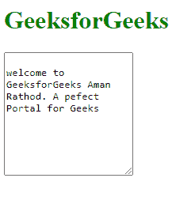
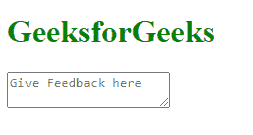

# 如何在 HTML5 中创建多行输入控件文本区？

> 原文:[https://www . geesforgeks . org/how-create-a-multi-input-control-text-area-in-html 5/](https://www.geeksforgeeks.org/how-to-create-a-multiline-input-control-text-area-in-html5/)

HTML strong < textarea > 标签用于在 HTML5 中指定多行输入控件文本区域。 **<列>** 和 **<行>** 属性指定文本区域的大小。

**语法**

```html
<textarea rows="" cols=""> Contents... </textarea>
```

**<文本区>** 标签包含以下列出的 5 个属性:

*   **cols:** 指定文本区域的宽度。
*   **行:**指定文本区域的高度。
*   **名称:**保存输入控件的名称。
*   **maxlength 或 minlength:** 指定 textarea 中的最大或最小字符数。
*   **占位符:**指定 textarea 值的提示。

**例 1:**

在这个例子中，我们将设置 row 和 cols 属性来创建一个多行控件输入 textarea。

## 超文本标记语言

```html
<!DOCTYPE html>
<html>

<body>
    <h1 style="color:green;">
        GeeksforGeeks
    </h1>
    <textarea rows="10" cols="20">
        welcome to GeeksforGeeks Aman Rathod.
        A perfect Portal for Geeks
    </textarea>
</body>

</html>
```

**输出:**



**示例 2:** 在本例中，我们将设置输入文本区域中允许的字符数。

## 超文本标记语言

```html
<!DOCTYPE html>
<html>

<body>
    <h1 style="color:green;">
      GeeksforGeeks
    </h1>
    <textarea minlenght="100" maxlength="300"
        placeholder="Give Feedback here">
    </textarea>
</body>

</html>
```

**输出:**

