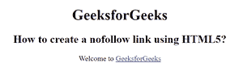

# 如何用 HTML5 创建 nofollow 链接？

> 原文:[https://www . geesforgeks . org/how-create-a-no follow-link-use-html 5/](https://www.geeksforgeeks.org/how-to-create-a-nofollow-link-using-html5/)

一个 **nofollow 链接**被谷歌用来指定谷歌搜索蜘蛛不应该跟随该链接，并且主要用于付费链接。

Nofollow 链接是应用了 rel="nofollow" HTML 标记的链接。nofollow 标签告诉搜索引擎忽略这个链接。nofollow 链接没有通过 PageRank，它们可能不会影响搜索引擎排名。

**语法:**

```html
<a rel="value"> 

```

示例:

## 超文本标记语言

```html
<!DOCTYPE html> 
<html> 

<head> 
    <title>
        How to create a nofollow 
        link using HTML5 ?
    </title> 
</head> 

<body style="text-align:center">  
     <h1>
         GeeksforGeeks
     </h1>
     <h2>
         How to create a nofollow 
            link using HTML5? 
     </h2>

<p>Welcome to 
        <a rel="nofollow"
        href="https://ide.geeksforgeeks.org/"> 
                GeeksforGeeks 
        </a> 
    </p>

</body> 

</html>                    
```

**输出**



**支持的浏览器如下:**

*   谷歌 Chrome
*   微软公司出品的 web 浏览器
*   火狐浏览器
*   歌剧
*   旅行队