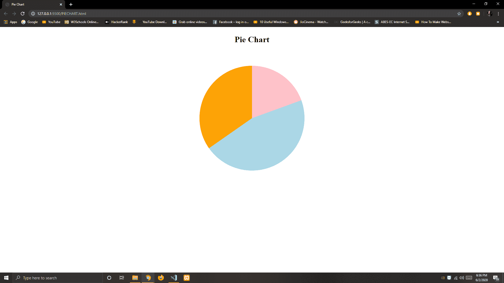

# 如何使用 HTML & CSS 创建饼图？

> 原文:[https://www . geeksforgeeks . org/如何使用 html-css 创建饼图/](https://www.geeksforgeeks.org/how-to-create-a-pie-chart-using-html-css/)

**饼图**是一种以圆形显示数据的图形，通常用于显示百分比或比例数据。图表中每个类别所代表的百分比是在饼图的一部分的相应部分附近提供的。这些图表非常适合显示两个或更多类别的数据。

**HTML 代码:**在下面的代码中，显示了基本的设计或结构。

```html
<!DOCTYPE html>
<html lang="en">
<head>
    <meta charset="UTF-8">
    <meta name="viewport" content=
      "width=device-width, initial-scale=1.0">
    <title>Pie Chart</title>
    <link rel="stylesheet" href="style.css">
</head>
<body>
    <h1>Pie Chart</h1>
    <div class="piechart"></div>
</body>
</html>
```

**CSS 代码:**在下一节中，使用一些 CSS 属性演示了饼图的设计。

```html
<style>
    .piechart {
        margin-top: 300px;
        display: block;
        position: absolute;
        width: 400px;
        height: 400px;
        border-radius: 50%;
        background-image: conic-gradient(
            pink 70deg, 
            lightblue 0 235deg, 
            orange 0);
    }

    body,
    .piechart {
        display: flex;
        justify-content: center;
        align-items: center;
    }
</style>
```

**完整代码:**

```html
<!DOCTYPE html>
<html lang="en">

<head>
    <meta charset="UTF-8">
    <meta name="viewport" content=
        "width=device-width, initial-scale=1.0">

    <title>Pie Chart</title>

    <style>
        .piechart {
            margin-top: 300px;
            display: block;
            position: absolute;
            width: 400px;
            height: 400px;
            border-radius: 50%;
            background-image: conic-gradient(
                pink 70deg, 
                lightblue 0 235deg, 
                orange 0);
        }

        body,
        .piechart {
            display: flex;
            justify-content: center;
            align-items: center;
        }
    </style>
</head>

<body>
    <h1>Pie Chart</h1>
    <div class="piechart"></div>
</body>

</html>
```

**输出:**
