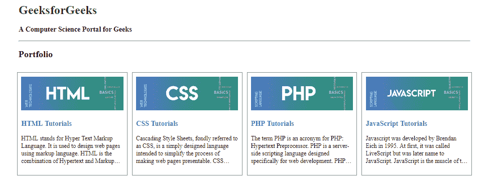

# 如何使用 HTML 和 CSS 创建作品集图库？

> 原文:[https://www . geeksforgeeks . org/如何使用 html 和 css 创建作品集图库/](https://www.geeksforgeeks.org/how-to-create-a-portfolio-gallery-using-html-and-css/)



为了创建一个作品集，我们只需要 HTML 和 CSS。我们也可以使用 JavaScript，但是在本文中，设置了限制，所以我们将只使用 HTML 和 CSS。将整篇文章分成两个不同的部分在第一部分，我们将为作品集画廊创建结构，在第二部分，我们将确保画廊看起来有吸引力。当您的网站包含不同类型的内容或如此多的内容时，组合库非常有用。在作品集图库的帮助下，您可以轻松地向用户显示首页中的所有内容。

**创建结构:**在本节中，我们将创建投资组合的基本网站结构。在这里，我们将附加标题属性，以便用户可以知道投资组合的每个网格上的内容类型。

*   **HTML 代码:**本节我们将设计 Portfolio Gallery 的基本结构。

## 超文本标记语言

```html
<!DOCTYPE html>
<html>

<head>
    <title>
        Create a Portfolio Gallery
        using HTML and CSS
    </title>

    <meta name="viewport"
        content="width=device-width, initial-scale=1">
</head>

<body>

    <!-- title and tag -->
    <div class="container">
        <h1>GeeksforGeeks</h1>
        <h3>A Computer Science Portal for Geeks</h3>
        <hr>

        <!-- Content of the body-->
        <h2>Portfolio</h2>
        <div class="row">
            <div class="column">
                <div class="content">
                    
                    <h3>
                        <a href="#">HTML Tutorials</a>
                    </h3>

<p>
                        HTML stands for Hyper Text Markup
                        Language. It is used to design web
                        pages using markup language. HTML
                        is the combination of Hypertext and
                        Markup language. Hypertext defines
                        the link between the web pages.
                    </p>

                </div>
            </div>

            <div class="column">
                <div class="content">
                    
                    <h3>
                        <a href="#">CSS Tutorials</a>
                    </h3>

<p>
                        Cascading Style Sheets, fondly referred
                        to as CSS, is a simply designed language
                        intended to simplify the process of
                        making web pages presentable. CSS allows
                        you to apply styles to web pages.
                    </p>

                </div>
            </div>

            <div class="column">
                <div class="content">
                    
                    <h3>
                        <a href="#">PHP Tutorials</a>
                    </h3>

<p>
                        The term PHP is an acronym for PHP:
                        Hypertext Preprocessor. PHP is a
                        server-side scripting language
                        designed specifically for web
                        development. PHP can be easily
                        embedded in HTML files.
                    </p>

                </div>
            </div>

            <div class="column">
                <div class="content">
                    
                    <h3>
                        <a href="#">JavaScript Tutorials</a>
                    </h3>

<p>
                        Javascript was developed by Brendan
                        Eich in 1995\. At first, it was called
                        LiveScript but was later name to
                        JavaScript. JavaScript is the muscle
                        of the structure
                    </p>

                </div>
            </div>
        </div>
    </div>
</body>

</html>
```