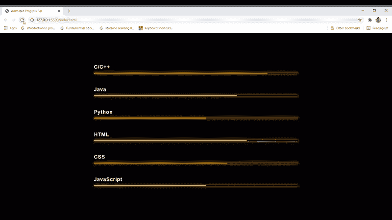

# 如何使用 HTML 和 CSS 创建进度条动画？

> 原文:[https://www . geesforgeks . org/如何使用 html 和 css 创建进度条-动画/](https://www.geeksforgeeks.org/how-to-create-a-progress-bar-animation-using-html-and-css/)

在这个迷你网络开发项目中，我们将利用 CSS 动画，并使用它们创建一个进度条。进度条会从零开始，到我们想要的某个程度。进度条基本上是以动画的形式展示不同语言的程序员的专业知识。

**先决条件:**HTML 基础，如标签、div、id、类，以及 CSS 基础，如边距、填充、颜色、字体和动画等。

**进场:**

*   首先我们将使用 HTML 创建基本结构。在 body 标签中，我们将创建一个分部，并给它一个类，以便以后可以使用 CSS 来定位它。在这个 div 中，我们将为我们想要展示的每种语言创建几个 div，并使用< h2 >标签来命名它们，例如 HTML、CSS、C/C++、Java 等。
*   在 CSS 部分，最初我们会给主体加上边距、填充和背景色。之后，我们将针对每个 h2 标签，并给出动画效果，字体大小，字体颜色等。
*   在 CSS 部分，我们还会给每个组件赋予边框框设计，并分配橙色来美化设计。

**示例:**

## 超文本标记语言

```html
<!DOCTYPE html>
<html lang="en">

<head>
    <style>
        * {
            margin: 0;
            padding: 0;
            box-sizing: border-box;
        }

        /* Styling the body of the page */
        body {
            height: 100vh;
            display: flex;
            justify-content: center;
            align-items: center;
            background-color: #010101;
        }

        /* Stylingthe last h2 tag by giving margin bottom */
        .progress-bar-container:not(:last-child) {
            margin-bottom: 50px;
        }

        /* Styling the h2 tag by giving color,
        letter spacing, font-size etc.*/
        .progress-bar-container h2 {
            font-family: Arial, Helvetica, sans-serif;
            color: #eee;
            letter-spacing: 1px;
            font-size: 20px;
        }

        /* Styling the border and box
        effect of the progress bar*/
        .progress-bar {
            width: 800px;
            height: 5px;
            margin-top: 10px;
            border: 1px solid #565656;
            border-radius: 5px;
            box-shadow: 0 0 10px rgb(245, 159, 0);
        }

        /* Stylingthe background color of each
        animation and border radius */
        .percentage {
            display: block;
            height: 100%;
            background-color: orange;
            border-radius: 5px;
            animation: progress 1500ms ease-in 1;
        }

        /* Assigning width of each languages*/
        .c {
            width: 85%;
        }

        .java {
            width: 70%;
        }

        .python {
            width: 55%;
        }

        .html {
            width: 75%;
        }

        .css {
            width: 65%;
        }

        .javascript {
            width: 55%;
        }

        /* Animating the progress bar by
        initially starting from 0*/
        @keyframes progress {
            from {
                width: 0;
            }
        }
    </style>
</head>

<body>
    <div class="skills">
        <div class="progress-bar-container">
            <h2>C/C++</h2>
            <div class="progress-bar">
                <span class="percentage c"></span>
            </div>
        </div>

        <div class="progress-bar-container">
            <h2>Java</h2>
            <div class="progress-bar">
                <span class="percentage java"></span>
            </div>
        </div>

        <div class="progress-bar-container">
            <h2>Python</h2>
            <div class="progress-bar">
                <span class="percentage python"></span>
            </div>
        </div>

        <div class="progress-bar-container">
            <h2>HTML</h2>
            <div class="progress-bar">
                <span class="percentage html"></span>
            </div>
        </div>

        <div class="progress-bar-container">
            <h2>CSS</h2>
            <div class="progress-bar">
                <span class="percentage css"></span>
            </div>
        </div>

        <div class="progress-bar-container">
            <h2>JavaScript</h2>
            <div class="progress-bar">
                <span class="percentage javascript"></span>
            </div>
        </div>
    </div>
</body>

</html>
```

**输出:**

