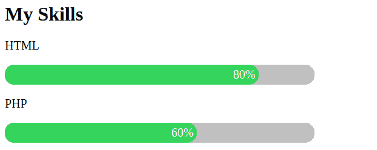

# 如何使用 HTML 和 CSS 创建进度条？

> 原文:[https://www . geeksforgeeks . org/如何使用 html 和 css 创建进度条/](https://www.geeksforgeeks.org/how-to-create-a-progress-bar-using-html-and-css/)

进度条是网页中的一个重要元素，进度条可以用来下载、获取分数、技能衡量单位等。要创建进度条，我们可以使用 **[HTML](https://www.geeksforgeeks.org/html-tutorials/)** 和 **[CSS](https://www.geeksforgeeks.org/css-tutorials/)** 。为了让进度条有响应，你需要 **[JavaScript](https://www.geeksforgeeks.org/javascript-tutorial/)** 。

*   **[如何使用 JavaScript 创建进度条？](https://www.geeksforgeeks.org/creating-progress-bar-using-javascript/)T3】**

在本文中，我们将学习使用 HTML 和 CSS 创建进度条。进度条是通过使用两个 HTML“div”创建的，容器(父 div)和技能(子 div)，如下例所示。

**示例 1:** 我们将文章分为两个编码部分，在第一部分我们将处理 HTML，在第二部分我们将设计那个进度条。

*   **HTML 代码:**我们创建一个父 div，它将定义完整的长度单位，子 div 将定义获取单位。

    ```html
    <!DOCTYPE html>
    <html>
    <head>
        <title>Design a Progress bar</title>
    </head>
    <body>
        <h1>My Skills</h1>
        <p>HTML</p>
        <div class="container">
            <div class="skill html">80%</div>
        </div>

        <p>PHP</p>
        <div class="container">
            <div class="skill php">60%</div>
        </div>
    </body>

    </html>
    ```

*   **CSS 代码:**通过使用 CSS，我们将装饰 div，填充颜色和获得单位。也设置草皮的长度。

    ```html
    <style>
        p {
            font-size: 20px;
        }

        .container {
            background-color: rgb(192, 192, 192);
            width: 80%;
            border-radius: 15px;
        }

        .skill {
            background-color: rgb(116, 194, 92);
            color: white;
            padding: 1%;
            text-align: right;
            font-size: 20px;
            border-radius: 15px;
        }

        .html {
            width: 80%;
        }

        .php {
            width: 60%;
        }
    </style>
    ```

**最终编码:**这里我们将结合以上两个编码部分。

```html
<!DOCTYPE html>
<html>
<head>
    <style>
        p {
            font-size: 20px;
        }

        .container {
            background-color: rgb(192, 192, 192);
            width: 80%;
                border-radius: 15px;
        }

        .skill {
            background-color: rgb(116, 194, 92);
            color: white;
            padding: 1%;
            text-align: right;
            font-size: 20px;
                border-radius: 15px;
        }

        .html {
            width: 80%;
        }

        .php {
            width: 60%;
        }
    </style>
</head>
<body>
    <h1>My Skills</h1>
    <p>HTML</p>
    <div class="container">
        <div class="skill html">80%</div>
    </div>

    <p>PHP</p>
    <div class="container">
        <div class="skill php">60%</div>
    </div>
</body>
</html>
```

**输出:**
