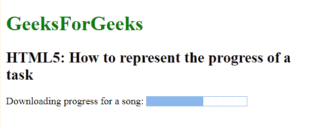

# 如何用 HTML5 创建进度条？

> 原文:[https://www . geesforgeks . org/如何使用-html5 创建进度条/](https://www.geeksforgeeks.org/how-to-create-a-progress-bar-using-html5/)

在本文中，我们通过使用 [<进度>标记](https://www.geeksforgeeks.org/html-5-progress-tag/)来创建任务的进度条。它用于表示任务的进度。它也被定义为完成了多少工作，还剩下多少。它不用于表示磁盘空间或相关查询。

**语法:**

```html
<progress attributes...> </progress>
```

**示例:**

```html
<!DOCTYPE html>
<html>

<head>
    <title>
        Represent the progress of a task
    </title>
</head>

<body>
    <h1 style="color:green;">
        GeeksForGeeks
    </h1>

    <h2>
        HTML5: How to represent 
        the progress of a task
    </h2>

    Downloading progress for a song:
    <progress value="57" max="100">
    </progress>
</body>

</html>               
```

**输出:**


**支持的浏览器如下:**

*   谷歌 Chrome
*   微软公司出品的 web 浏览器
*   火狐浏览器
*   歌剧
*   旅行队