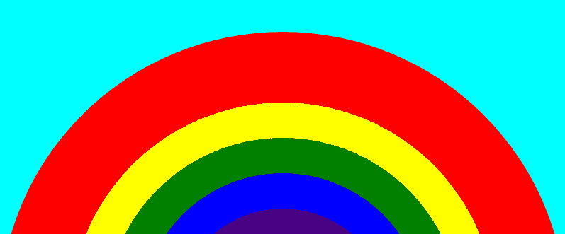

# 如何用 HTML5 创建彩虹？

> 原文:[https://www . geesforgeks . org/how-to-create-a-rainbow-use-html 5/](https://www.geeksforgeeks.org/how-to-create-a-rainbow-using-html5/)

在本文中，我们将讨论如何使用 HTML5 创建彩虹。为了创建彩虹，我们必须知道 SVG 标签如何工作及其属性。

**进场:**

*   首先，我们必须使用 SVG 标签的宽度和高度属性来创建彩虹结构的基础。
*   现在我们将使用圆形元素来创建彩虹的结构，并用各自的颜色填充它。

```html
<!DOCTYPE html>
<html>

<body>
    <!-- Here the background color is aqua -->
    <!-- To make the circle 1/2 in order to 
        create the rainbow structure we need 
        to give a height that makes the 
        circle 1/2 -->
    <svg width="800" height="400" 
        style="background-color: aqua;">

        <!-- In order to create the rainbow 
        we have to use the circle element -->
        <!-- Here we will use circle attribute 
        to properly align the half circle 
        with a radius at correct position -->
        <!-- Here to make the color red we have 
        to use the attribute fill-->
        <!-- stroke-width defines the thickness-->
        <circle cx="400" cy="450" r="400" stroke="none"
            stroke-width="2" fill="red" />

        <!-- r defines the radius of the circle  -->
        <circle cx="400" cy="450" r="300" stroke="none" 
            stroke-width="2" fill="yellow" />
        <circle cx="400" cy="450" r="250" stroke="none" 
            stroke-width="2" fill="green" />
        <circle cx="400" cy="450" r="200" stroke="none" 
            stroke-width="2" fill="blue" />
        <circle cx="400" cy="450" r="150" stroke="none" 
            stroke-width="2" fill="indigo" />
        <circle cx="400" cy="450" r="100" stroke="none" 
            stroke-width="2" fill="violet" />
    </svg>
</body>

</html>
```

**输出:**
