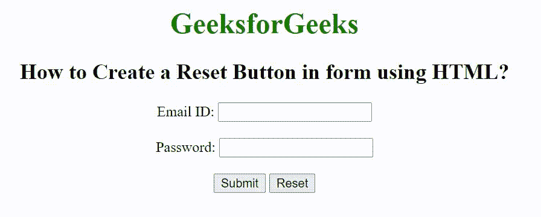

# 如何使用 HTML 在表单中创建重置按钮？

> 原文:[https://www . geesforgeks . org/如何使用 html 创建表单重置按钮/](https://www.geeksforgeeks.org/how-to-create-a-reset-button-in-form-using-html/)

在本文中，我们将学习如何在 HTML 表单中创建一个**重置按钮**。基本上，重置按钮用于重置所有表单数据值，并设置为其初始默认值。如果用户输入了错误的数据，那么用户可以通过点击“重置按钮”来轻松纠正。

**方法:**这里有一个添加重置按钮的简单方法–

*   首先，我们创建一个包含

    <form>元素的 HTML 文档。</form>

*   在表单元素下创建一个<input>元素。
*   使用带有<input>元素的类型属性。
*   将类型属性设置为值“重置”。

**语法**

```html
<input type="reset">
```

**示例:**

## 超文本标记语言

```html
<!DOCTYPE html>
<html>

<head>
    <title>
        How to Create a Reset Button 
        in form using HTML?
    </title>
</head>

<body style="text-align:center;">

    <h1 style="color:green;">
        GeeksforGeeks
    </h1>

    <h2>
        How to Create a Reset Button 
        in form using HTML?
    </h2>

    <form>
        Email ID:
        <input type="email">
        <br>
        <br> Password:
        <input type="password">
        <br><br>

        <input type="submit">
        <input type="reset">
    </form>
</body>

</html>
```

**输出:**

