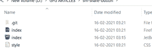

# 如何使用 HTML & CSS 创建不同社交手柄的共享按钮？

> 原文:[https://www . geesforgeks . org/how-create-share-button-with-differential-social-hands-use-html-CSS/](https://www.geeksforgeeks.org/how-to-create-a-share-button-with-different-social-handles-using-html-css/)

在本文中，我们将创建一个共享按钮，当我们点击该按钮时，该按钮将显示社交媒体帐户以在其上共享特定内容。


**进场:**

*   创建一个 HTML 文件，我们将在其中添加不同类型的社交媒体图标。
*   创建一个 CSS 样式给网页元素一些动画效果。
*   创建一个 JS 文件来添加可以检测鼠标点击事件的事件监听器。

**HTML 代码:**

1.  首先，创建一个 HTML 文件(index.html)。
2.  然后我们将提供所有动画效果的 CSS 文件链接到我们的 HTML。这也放在标签之间。
3.  来到我们的 HTML 代码的主体部分。
    1.  我们必须添加不同的社交媒体图标。
    2.  在主体标签的末尾，我们必须添加两个

## 超文本标记语言

```html
<!DOCTYPE html>
<html lang="en">

<head>
    <link rel="stylesheet" href="style.css">

    <script src="https://kit.fontawesome.com/704ff50790.js" 
        crossorigin="anonymous">
    </script>

    <script src="index.js"></script>
</head>

<body>
    <div class="main_box">
        <input type="checkbox" id="share_button">
        <label for="share_button">
            <span class="sharebtn" >
              <i class="far fa-share-square"></i>
            </span>
        </label>

        <div class="sm_list">
            <a href="#" class="facebook">
              <i class="fab fa-facebook-f"></i>
            </a>
            <a href="#" class="instagram">
              <i class="fab fa-instagram"></i>
            </a>
            <a href="#" class="linkedin">
              <i class="fab fa-linkedin-in"></i>
            </a>
            <a href="#" class="discord">
              <i class="fab fa-discord"></i>
            </a>
            <a href="#" class="whatsapp">
              <i class="fab fa-whatsapp"></i>
            </a>
            <a href="#" class="slack">
              <i class="fab fa-slack"></i>
            </a>
        </div>
    </div>
</body>

</html>
```

**CSS 代码:** CSS 用来给我们的 HTML 页面赋予不同类型的动画和效果，让所有用户看起来都是交互式的。

在 CSS 中，我们必须提醒以下几点–

*   恢复所有浏览器效果。
*   使用类和 id 给 HTML 元素赋予效果。
*   使用:悬停来使用悬停效果

## 半铸钢ˌ钢性铸铁(Cast Semi-Steel)

```html
/* Restoring browsering effects */
*{
    margin:0;
    padding: 0;
    box-sizing: border-box;
}

body{
    height: 100vh;
    display: flex;
    justify-content: center;
    align-items: center;
    background-color: #000;
}

.main_box{
    width: 4em;
    height: 4em;
    position: relative;
}

#share_button{
    display: none;
}

span,a{
    position: absolute;
    display: flex;
    justify-content: center;
    align-items: center;
    border-radius: 50%;
}

span{
    width: 4em;
    height: 4em;
    top: 50%;
    left: 50%;
    transform: translate(-50%,-50%);
    background-color: #eee;
    color: #333;
    font-size: 2em;
    z-index: 1;
    cursor: pointer;
    /* border-radius: 30%; */
}

.sm_list{
    width: 4em;
    height: 4em;
    position: absolute;
    top: 50%;
    left: 50%;
    transform: translate(-50%,-50%);
}

.sm_list a{
    width: 4em;
    height: 4em;
    border-radius: 50%;
    text-decoration: none;
    color: #fff;
    transition: all .3s;
    font-size: 1.5em;
}

#share_button:checked ~ .sm_list a:nth-child(1){
    background-color: #3B5998;
    transition-delay: 0.2s;
    transform: translateX(-6em);
}

#share_button:checked ~ .sm_list a:nth-child(2){
    background-color: #dd2553;
    transition-delay: 0.2s;
    transform: translateX(6em);
}

#share_button:checked ~ .sm_list a:nth-child(3){
    background-color: #000f94;
    transition-delay: 0.3s;
    transform: translateX(12em);
}

#share_button:checked ~ .sm_list a:nth-child(4){
    background-color: #1077ec;
    transition-delay: 0.3s;
    transform: translateX(-12em);
}

#share_button:checked ~ .sm_list a:nth-child(5){
    background-color: rgb(10, 63, 0);
    transition-delay: 0.4s;
    transform: translateX(18em);
}

#share_button:checked ~ .sm_list a:nth-child(6){
    background: linear-gradient(70deg,blue,green,red,yellow);
    transition-delay: 0.4s;
    transform: translateX(-18em);
}

/* Hovering Effects */
#share_button:checked ~ .sm_list a:nth-child(1):hover{
    background-color: #ffffff;
    color: #3B5998;
    /* transition-delay: 0.2s;
    transform: translateX(-6em); */
}

#share_button:checked ~ .sm_list a:nth-child(2):hover{
    color: #dd2553;
    background-color: #fff;
}

#share_button:checked ~ .sm_list a:nth-child(3):hover{
    color: #000f94;
    background-color: #fff;
}

#share_button:checked ~ .sm_list a:nth-child(4):hover{
    color: #1077ec;
    background-color: #fff;
}

#share_button:checked ~ .sm_list a:nth-child(5):hover{
    color: rgb(10, 63, 0);
    background-color: #fff;
}

#share_button:checked ~ .sm_list a:nth-child(6):hover{
    color: black;
    background-image: linear-gradient(90deg,white,grey);
}

span:visited{
    background-color: #000f94;
}
```

**JavaScript 代码:**

## java 描述语言

```html
// Selecting the html class and  
// convert it to an object

const sharebtn = 
    document.querySelector('.sharebtn')

// Creating a bool variable for changing
// the image of share button 
var bool = 0

// Adding an event listener
sharebtn.addEventListener('click', () => {

    // As we clicked the mouse over
    // the share button the bool value.
    //  get flipped and then working of
    // if-else loop get starts
    bool = !bool

    if (bool == 0) {
        sharebtn.innerHTML =
            '<i class="far fa-share-square"></i>'
    } else {
        sharebtn.innerHTML =
            '<i class="fas fa-times"></i>'
    }
})
```

**运行代码的步骤:**

**1。我们的项目结构是这样的**



 **2。打开 index.html 文件开始项目**

**输出:**


*这样就可以通过改变社交手柄和造型效果来创建自己的分享按钮。*