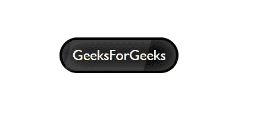

# 如何用 HTML 和 CSS 创建一个闪亮的按钮？

> 原文:[https://www . geesforgeks . org/how-to-create-a-shinny-button-use-html-and-CSS/](https://www.geeksforgeeks.org/how-to-create-a-shinny-button-using-html-and-css/)

毫无疑问，按钮是任何网站或应用程序最重要的组成部分之一。一个按钮的设计应该使它从其他组件中脱颖而出，这样用户就可以清楚地知道在哪里点击以及按钮的用途。有无数种方法可以设置按钮的样式。我们将研究如何创建一个闪亮的按钮。你们可能都见过光从一端移动到另一端，当它在某个闪亮的表面反射时。我们将在鼠标悬停上实现同样的事情。

**方式:**方式是在之前使用伪选择器[，在](https://www.geeksforgeeks.org/css-before-selector/)之后使用[。使用前，我们将制作条状效果，使用后，我们将确保它来回移动，给它一种反射的外观，使我们的按钮看起来闪闪发光。](https://www.geeksforgeeks.org/css-after-selector/)

**HTML 代码:**在本节中，我们已经创建了一个按钮。

```html
<!DOCTYPE html>
<html lang="en">
  <head>
    <meta charset="UTF-8" />
    <meta name="viewport" content=
    "width=device-width, initial-scale=1.0" />
    <title>Gradient Text</title>
  </head>
<body>
    <button>GeeksForGeeks</button>
  </body>
</html>
```

**CSS 代码:**对于 CSS，请按照下面给出的步骤操作。

*   **第一步:**首先做一些按钮的基本造型，比如背景和边框半径。
*   **第二步:**现在使用插入阴影属性给按钮边框内侧一个阴影。
*   **步骤 3:** 现在使用之前选择器创建一个条。诀窍是使用小于按钮实际宽度的宽度和等于按钮实际高度的高度。歪斜函数的使用是完全可选的，如果你想的话可以跳过。我们用它来做一个稍微倾斜的长条。
*   **第 4 步:**现在使用悬停将长条向左移动。
*   **第 5 步:**重复第 3 步和第 4 步，选择后将宽度改为负值，将试条移回其原始位置。

**提示:**可以使用一些线条和长度间距，在按钮的文字周围腾出一些空间，让它看起来更加清晰。

```html
<style>
  button {
    position: absolute;
    top: 40%;
    left: 40%;
    width: 200px;
    height: 60px;
    text-align: center;
    background: black;
    font-size: 24px;
    color: white;
    font-family: "Gill Sans", "Gill Sans MT", 
      Calibri, "Trebuchet MS", sans-serif;
    border-radius: 60px;
    border: 4px solid black;
    box-shadow: inset 0 0 30px rgb(97, 96, 96);
  }

  button::before {
    content: "";
    position: absolute;
    top: 0;
    left: 10px;
    width: 70%;
    height: 100%;
    background: rgba(255, 255, 255, 0.1);
    transition: 0.5s;
    transform: skewX(-15deg);
  }
  button:hover::before {
    left: 190px;
  }

  button::after {
    content: "";
    position: absolute;
    top: 0;
    left: -70px;
    width: 50px;
    height: 100%;
    background: rgba(255, 255, 255, 0.1);
    transition: 0.5s;
    transform: skewX(-15deg);
  }
  button:hover::after {
    left: 190px;
  }
</style>
```

**完整代码:**是上面两段代码的组合。

```html
<!DOCTYPE html>
<html lang="en">
  <head>
    <meta charset="UTF-8" />
    <meta name="viewport" content=
    "width=device-width, initial-scale=1.0" />
    <title>Gradient Text</title>
  </head>

  <style>
    button {
      position: absolute;
      top: 40%;
      left: 40%;
      width: 200px;
      height: 60px;
      text-align: center;
      background: black;
      font-size: 24px;
      color: white;
      font-family: "Gill Sans", "Gill Sans MT", 
        Calibri, "Trebuchet MS", sans-serif;
      border-radius: 60px;
      border: 4px solid black;
      box-shadow: inset 0 0 30px rgb(97, 96, 96);
    }

    button::before {
      content: "";
      position: absolute;
      top: 0;
      left: 10px;
      width: 70%;
      height: 100%;
      background: rgba(255, 255, 255, 0.1);
      transition: 0.5s;
      transform: skewX(-15deg);
    }
    button:hover::before {
      left: 190px;
    }

    button::after {
      content: "";
      position: absolute;
      top: 0;
      left: -70px;
      width: 50px;
      height: 100%;
      background: rgba(255, 255, 255, 0.1);
      transition: 0.5s;
      transform: skewX(-15deg);
    }
    button:hover::after {
      left: 190px;
    }
  </style>
  <body>
    <button>GeeksForGeeks</button>
  </body>
</html>
```

**输出:**
