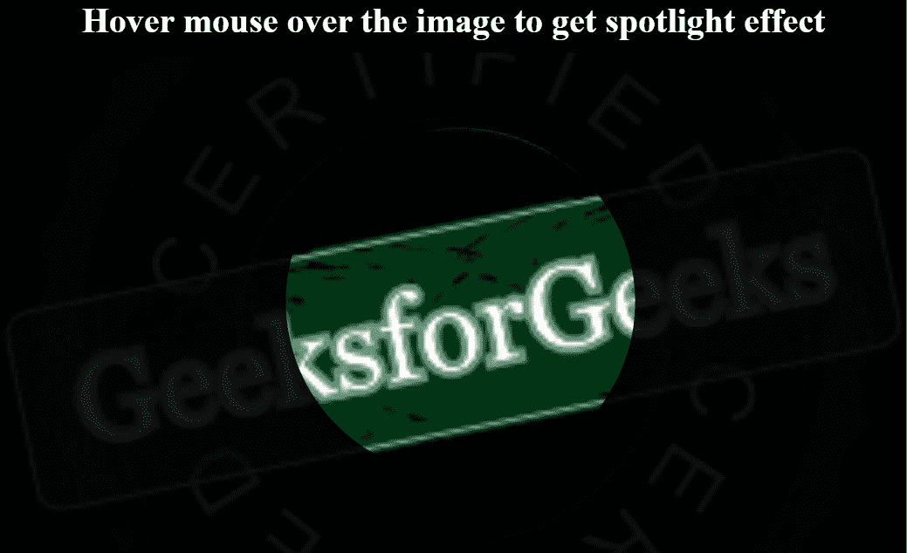

# 如何使用 HTML 和 CSS 创建聚光灯效果？

> 原文:[https://www . geeksforgeeks . org/如何使用 html 和 css 创建聚光灯效果/](https://www.geeksforgeeks.org/how-to-create-a-spotlight-effect-using-html-and-css/)

在本文中，我们将在图像上方悬停时创建聚光灯效果。这主要是基于 HTML、CSS 和 JavaScript。必须遵循以下步骤来创建这种效果。

**HTML 部分:**在这个部分，我们将为背景图像和鼠标指针创建一个容器元素。CSS 和 JavaScript 文件也链接在这里。

## 超文本标记语言

```html
<!DOCTYPE html>
<html>

<head>
    <link rel="stylesheet" href="style.css">
    <script src="index.js"></script>
</head>

<body>
    <h1>
        Hover mouse over the image 
        to get spotlight effect
    </h1>

    <div class="main_box">
        <div class="img"></div>
        <div class="mouse"></div>
    </div>
</body>

</html>
```

**CSS 版块:**在这个版块中，CSS 被用来给我们的 HTML 页面赋予不同类型的动画和效果，让它在用户看来具有交互性。首先重置浏览器效果，然后设置图像和鼠标指针的位置和大小。[滤镜](https://www.geeksforgeeks.org/css-filter-property/)属性用于给元素赋予视觉效果。[剪辑路径](https://www.geeksforgeeks.org/css-clip-path-property/)属性用于将元素转换为不同类型的形状。

## 半铸钢ˌ钢性铸铁(Cast Semi-Steel)

```html
/* Resetting the browser stylesheet */
* {
    padding: 0;
    margin: 0;
    box-sizing: border-box;
    overflow: hidden;
    background-color: #000;
    color: #fff;
}

/* Styling the heading */
h1 {
    display: flex;
    align-items: center;
    align-content: center;
    justify-content: center;
}

/* Position the mouse pointer and
    the background image */
.main_box,
.img,
.mouse {
    position: absolute;
    top: 0;
    left: 0;
    width: 100%;
    height: 100%;
}

.main_box {
    cursor: none;
    margin-top: 3em;
}

.img,
.mouse {
    background-image: url(
'https://media.geeksforgeeks.org/wp-content/cdn-uploads/20190417124305/250.png');
    background-size: cover;
    background-repeat: no-repeat;
    background-position: center;
}

/* Reduce the brightness of the image */
.img {
    filter: brightness(10%);
}

/* Make a circle with the clip-path
    property for the spotlight in the effect */
.mouse {
    clip-path: circle(5em at 0, 0);
}
```

**JavaScript 部分:**这个部分处理网页的交互部分。它使用[偏移](https://www.geeksforgeeks.org/html-dom-mouseevent-offsetx-property/)和[偏移](https://www.geeksforgeeks.org/html-dom-mouseevent-offsetx-property/)属性来获取 X 和 Y 坐标，从而检测图像上的鼠标移动。然后使用剪辑路径属性为聚光灯效果创建一个圆。

## java 描述语言

```html
// Select the container box and the mouse placeholder
let main = document.querySelector('.main_box');
let mouse = document.querySelector('.mouse');

// Add an event listener for detecting
// the movement of the mouse
main.addEventListener('mousemove', 
                      (e) => {

  // Use a circle with a clipPath
  // and the offsetX and offsetY property
  mouse.style.clipPath = 
    `circle(10em at ${e.offsetX}px ${e.offsetY}px)`;
});
```

**完整代码:**是以上三段代码的组合。

## 超文本标记语言

```html
<!DOCTYPE html>
<html>

<head>
    <style>
        /* Resetting the browser stylesheet */
        * {
            padding: 0;
            margin: 0;
            box-sizing: border-box;
            overflow: hidden;
            background-color: #000;
            color: #fff;
        }

        /* Styling the heading */
        h1 {
            display: flex;
            align-items: center;
            align-content: center;
            justify-content: center;
        }

        /* Position the mouse pointer and
            the background image */
        .main_box,
        .img,
        .mouse {
            position: absolute;
            top: 0;
            left: 0;
            width: 100%;
            height: 100%;
        }

        .main_box {
            cursor: none;
            margin-top: 3em;
        }

        .img,
        .mouse {
            background-image: url(
'https://media.geeksforgeeks.org/wp-content/cdn-uploads/20190417124305/250.png');
            background-size: cover;
            background-repeat: no-repeat;
            background-position: center;
        }

        /* Reduce the brightness of the image */
        .img {
            filter: brightness(10%);
        }

        /* Make a circle with the clip-path property
            for the spotlight in the effect */
        .mouse {
            clip-path: circle(5em at 0, 0);
        }
    </style>
</head>

<body>
    <h1>
        Hover mouse over the image 
        to get spotlight effect
    </h1>

    <div class="main_box">
        <div class="img"></div>
        <div class="mouse"></div>
    </div>

    <script>

        // Select the container box and the 
        // mouse placeholder
        let main = document.querySelector('.main_box');
        let mouse = document.querySelector('.mouse');

        // Add an event listener for detecting
        // the movement of the mouse
        main.addEventListener('mousemove',
            (e) => {

                // Use a circle with a clipPath
                // and the offsetX and offsetY property
                mouse.style.clipPath =
        `circle(10em at ${e.offsetX}px ${e.offsetY}px)`;
            });
    </script>
</body>

</html>
```

**输出:**

