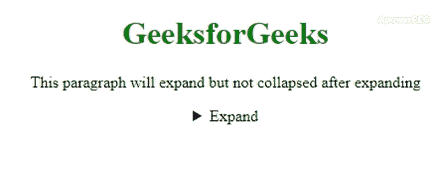

# 如何使用 HTML 创建一个可以扩展但不能收缩的汇总元素？

> 原文:[https://www . geeksforgeeks . org/如何使用 html 创建一个可以扩展但永远不会收缩的摘要元素/](https://www.geeksforgeeks.org/how-to-create-a-summary-element-that-can-expands-but-never-shrink-using-html/)

可以在很多网站上看到，比如阅读更多包含链接的按钮。当用户单击“阅读更多”链接或按钮时，这些内容会展开，然后在展开后，就没有折叠展开内容的选项了。在本文中，我们将删除折叠选项。我们需要两个元素 [**<细节>**](https://www.geeksforgeeks.org/html5-details-tag/) 和 [**<汇总>**](https://www.geeksforgeeks.org/html-5-summary-tag/) 来创建那种界面，通过应用 CSS [**“显示:无；”**](https://www.geeksforgeeks.org/css-display-property/) 属性。
这个功能不是一个好选项，但是很少有开发者要求应用 **CSS 显示来设计这种界面:无；**属性。我们可以从**摘要**中删除折叠选项。

以下示例说明了上述方法:

**语法:**

```html
<style>
details[open] summary {
    display: none;
}
<style>
```

**示例:**

## 超文本标记语言

```html
<!DOCTYPE html>
<html>

<head>
    <title>
        Create a details element that opens
        but never closes
    </title>

    <style>
        .container {
            text-align: center;
        }

        h1 {
            color: green;
        }

        details[open] summary {
            display: none;
        }
    </style>
</head>

<body>
    <div class="container">
        <h1>GeeksforGeeks</h1>

<p>
            This paragraph will expand but not
            collapsed after expanding
        </p>

        <details>
            <summary>Expand</summary>
            A Computer Science Portal for Geeks
        </details>
    </div>
</body>

</html>
```

**输出:**

