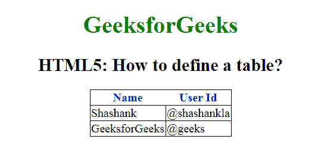

# 如何用 HTML5 创建表格？

> 原文:[https://www . geeksforgeeks . org/如何使用 html5 创建表格/](https://www.geeksforgeeks.org/how-to-create-a-table-by-using-html5/)

使用 HTML 页面中的“表格”标签来定义一个 HTML 表格。每个表行都用“tr”标记定义。表格标题用“th”标记定义。默认情况下，表格标题是粗体和居中的。表格数据或单元格用“td”标记定义。

**语法:**

```html
<table> Contents... </table>

```

**示例:**

## 超文本标记语言

```html
<!DOCTYPE html>
<html>

<head>
    <style>
        body {
            text-align: center;
        }

        h1 {
            color: green;
        }

        th {
            color: blue;
        }

        table,
        tbody,
        td {
            border: 1px solid black;
            border-collapse: collapse;
        }
    </style>
</head>

<body>
    <center>
        <h1>GeeksforGeeks</h1>
        <h2>
            HTML5: How to define a table?
        </h2>
        <table>
            <thead>
                <!-- tr tag starts here -->
                <tr>
                    <th>Name</th>
                    <th>User Id</th>
                </tr>
                <!-- tr tag end here -->
            </thead>
            <tbody>
                <tr>
                    <td>Shashank</td>
                    <td>@shashankla</td>
                </tr>
                <tr>
                    <td>GeeksforGeeks</td>
                    <td>@geeks</td>
                </tr>
            </tbody>
        </table>
    </center>
</body>

</html>                    
```

**输出:**



**支持的浏览器:**

*   谷歌 Chrome
*   微软公司出品的 web 浏览器
*   火狐浏览器
*   歌剧
*   旅行队