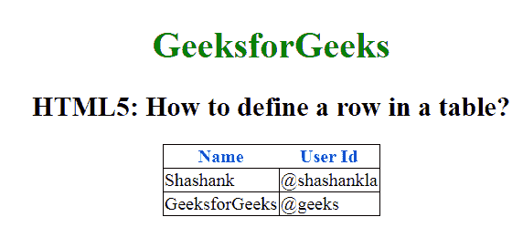

# 如何用 HTML5 创建表格行？

> 原文:[https://www . geeksforgeeks . org/如何使用-html5 创建表-行/](https://www.geeksforgeeks.org/how-to-create-a-table-row-using-html5/)

在本文中，我们通过在文档中使用 [< tr >标记](https://www.geeksforgeeks.org/html-tr-tag/)来定义表格中的一行。这个标签用来定义一个 HTML 表格中的一行。 **tr** 元素包含多个 **[th](https://www.geeksforgeeks.org/html-th-tag/)** 或 **[td](https://www.geeksforgeeks.org/html-td-tag/)** 元素。

**语法:**

```html
<tr> ... </tr>
```

**示例:**

```html
<!DOCTYPE html>
<html>

<head>
    <title>
        How to define row of a table
    </title>

    <style>
        body {
            text-align: center;
        }

        h1 {
            color: green;
        }

        th {
            color: blue;
        }

        table,
        tbody,
        td {
            border: 1px solid black;
            border-collapse: collapse;
        }
    </style>
</head>

<body>
    <center>
        <h1>GeeksforGeeks</h1>

        <h2>
            HTML5: How to define 
            a row in a table?
        </h2>
        <table>
            <thead>
                <!-- tr tag starts here -->
                <tr>
                    <th>Name</th>
                    <th>User Id</th>
                </tr>
                <!-- tr tag end here -->
            </thead>
            <tbody>
                <tr>
                    <td>Shashank</td>
                    <td>@shashankla</td>
                </tr>
                <tr>
                    <td>GeeksforGeeks</td>
                    <td>@geeks</td>
                </tr>
            </tbody>
        </table>
    </center>
</body>

</html>
```

**输出:**


**支持的浏览器:**

*   谷歌 Chrome
*   微软公司出品的 web 浏览器
*   火狐浏览器
*   歌剧
*   旅行队