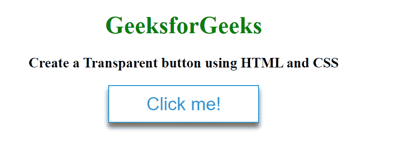

# 如何使用 HTML 和 CSS 创建透明按钮？

> 原文:[https://www . geeksforgeeks . org/如何使用 html 和 css 创建透明按钮/](https://www.geeksforgeeks.org/how-to-create-a-transparent-button-using-html-and-css/)

透明按钮可以通过使用 HTML 和 CSS 轻松创建。在本文中，我们将使用[背景色:透明；](https://www.geeksforgeeks.org/css-background-color-property/)属性设计透明背景按钮。

**HTML 代码:**在本节中，我们将使用[按钮标签](https://www.geeksforgeeks.org/html-button-tag/)创建按钮的基本结构。

```html
<!DOCTYPE html>
<html lang="en">

<head>
    <meta charset="utf-8">
    <title>
        Create a Transparent button
        using HTML and CSS
    </title>
</head>

<body>
    <h1>GeeksforGeeks</h1>

    <h3>
        Create a Transparent button
        using HTML and CSS
    </h3>

    <button class="btn">Click me!</button>
</body>

</html>
```

**CSS 代码:**在本节中，我们将使用 CSS 属性设计按钮。我们将使用[背景色:透明；](https://www.geeksforgeeks.org/css-background-color-property/)属性以透明外观设置按钮。

```html
<style>
    body {
        margin: 0;
        padding: 0;
        text-align: center;
    }

    h1 {
        color: green;
    }

    /* Styling the button */
    .btn {
        cursor: pointer;
        border: 1px solid #3498db;
        background-color: transparent;
        height: 50px;
        width: 200px;
        color: #3498db;
        font-size: 1.5em;
        box-shadow: 0 6px 6px rgba(0, 0, 0, 0.6);
    }
</style>
```

**完成代码:**在本节中，我们将结合以上两个部分创建一个透明的背景按钮。

```html
<!DOCTYPE html>
<html lang="en">

<head>
    <meta charset="utf-8">
    <title></title>

    <style>
        body {
            margin: 0;
            padding: 0;
            text-align: center;
        }

        h1 {
            color: green;
        }

        /* Styling the button */
        .btn {
            cursor: pointer;
            border: 1px solid #3498db;
            background-color: transparent;
            height: 50px;
            width: 200px;
            color: #3498db;
            font-size: 1.5em;
            box-shadow: 0 6px 6px rgba(0, 0, 0, 0.6);
        }
    </style>
</head>

<body>
    <h1>GeeksforGeeks</h1>

    <h3>
        Create a Transparent button
        using HTML and CSS
    </h3>

    <button class="btn">Click me!</button>
</body>

</html>
```

**输出:**
