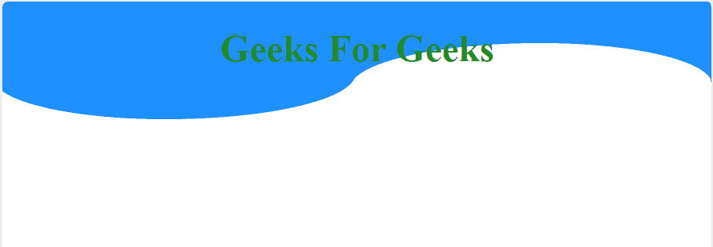
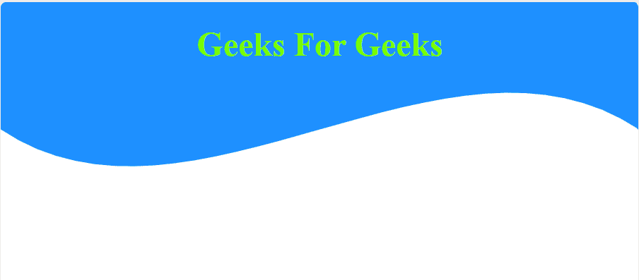
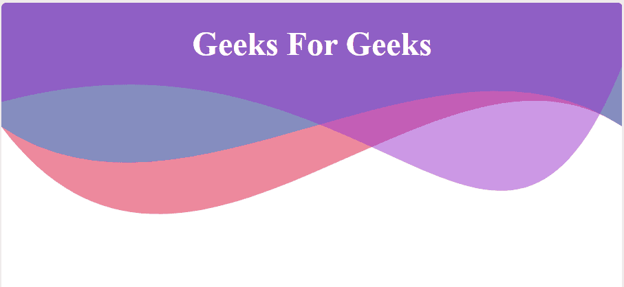

# 如何使用 HTML 和 CSS 为背景创建波浪图像？

> 原文:[https://www . geeksforgeeks . org/如何使用 html 和 css 为背景创建波形图像/](https://www.geeksforgeeks.org/how-to-create-a-wave-image-for-a-background-using-html-and-css/)

这种类型的背景通过避免常规矩形大小的背景或标题，在您的网页上创造独特性。下面的标题设计将展示你的创造力。这种设计可以通过两种方式实现:

*   在 CSS 中的 div 元素上使用**[:](https://www.geeksforgeeks.org/css-before-selector/)**之前和**[:](https://www.geeksforgeeks.org/css-after-selector/)**之后的选择器。
*   在 HTML 中使用 **[SVG](https://www.geeksforgeeks.org/html-svg-basics/)** 。

**示例:**本示例在 div 元素上使用`::before`和`::after`选择器来创建背景的波浪图像。

```html
<!DOCTYPE html>
<html>

<head>
    <title>
        How to Create a Wave Image
        for a Background using CSS?    
    </title>

    <style>
        .wave {
            position: absolute;
            top: 0px;
            left: 0px;
            right: 0px;
            height: 70px;
            width: 100%;
            background: dodgerblue;
            z-index: -1;
        }
        .wave::before {
            content: "";
            display: block;
            position: absolute;
            border-radius: 100% 90%;
            width: 51%;
            height: 75px;
            background-color: white;
            right: 0px;
            top: 35px;
        }
        .wave::after {
            content: "";
            display: block;
            position: absolute;
            border-radius: 100% 90%;
            width: 51%;
            height: 75px;
            background-color: dodgerblue;
            left: -8px;
            top: 25px;
        }
    </style>
</head>

<body style="text-align:center;">
    <h1 style="color:forestgreen;">
        Geeks For Geeks
    </h1>

    <div class="wave"></div>
</body>

</html>
```

**输出:**

**使用前后的问题**是因为我们必须定义它们在像素中的位置，因此随着屏幕高度的变化，其形状也随之变化，因此它并不像看起来那样合适。为此，我们在 CSS 中使用了 SVG。

**示例:**本示例使用 SVG 为背景设计波浪图像。

```html
<!DOCTYPE html>
<html>

<head>
    <title>
        How to Create a Wave Image
        for a Background using CSS?    
    </title>

    <style>
        svg {
            display: inline-block;
            position: absolute;
            top: 0;
            left: 0;
            z-index: -1;
        }
        .container {
            display: inline-block;
            position: absolute;
            width: 100%;
            padding-bottom: 100%;
            vertical-align: middle;
            overflow: hidden;
            top: 0;
            left: 0;
        }
        body {
            overflow: hidden;
        }
    </style>
</head>

<body style="text-align:center;">
    <h1 style="color:lawngreen;">
        Geeks For Geeks
    </h1>

    <div class="container">

        <!-- Creating a SVG image -->
        <svg viewBox="0 0 500 500" 
            preserveAspectRatio="xMinYMin meet">

            <path d="M0, 100 C150, 200 350,
                0 500, 100 L500, 00 L0, 0 Z"
                style="stroke:none; fill:dodgerblue;">
            </path>
        </svg>
    </div>
</body>

</html>
```

**输出:**


**示例:**本示例使用 SVG 为背景设计波浪图像。

```html
<!DOCTYPE html>
<html>

<head>
    <title>
        How to Create a Wave Image
        for a Background using CSS?    
    </title>

    <style>
        svg {
            display: inline-block;
            position: absolute;
            top: 0;
            left: 0;
        }
        .container {
            display: inline-block;
            position: absolute;
            width: 100%;
            padding-bottom: 100%;
            vertical-align: middle;
            overflow: hidden;
            top: 0;
            left: 0;
        }
        body {
            overflow: hidden;
        }
    </style>
</head>

<body style="text-align:center;">
    <h1 style="color:white;">
        Geeks For Geeks
    </h1>

    <div class="container">
        <svg viewBox="0 0 500 500" 
            preserveAspectRatio="xMinYMin meet"
            style="z-index: -2;">

            <path d="M0, 100 C150, 200 350,
                0 500, 100 L500, 00 L0, 0 Z"
                style="stroke: none; 
                fill:rgba(30, 144, 225, 0.5);">
            </path>
        </svg>
    </div>

    <div class="container">
        <svg viewBox="0 0 500 500" 
            preserveAspectRatio="xMinYMin meet"
            style="z-index:-1;">

            <path d="M0, 80 C300, 0 400, 
                300 500, 50 L500, 00 L0, 0 Z"
                style="stroke: none; 
                fill:rgba(153, 50, 204, 0.5);">
            </path>
        </svg>
    </div>

    <div class="container">
        <svg viewBox="0 0 500 500" 
            preserveAspectRatio="xMinYMin meet"
            style="z-index:-3;">

            <path d="M0, 100 C150, 300 350,
                0 500, 100 L500, 00 L0, 0 Z"
                style="stroke: none; 
                fill:rgba(220, 20, 60, 0.5);">
            </path>
        </svg>
    </div>
</body>

</html>
```

**输出:**
