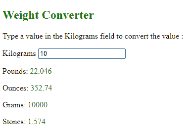

# 如何用 HTML 和 JavaScript 创建权重转换器？

> 原文:[https://www . geesforgeks . org/如何用 html 和 javascript 创建权重转换器/](https://www.geeksforgeeks.org/how-to-create-a-weight-converter-with-html-and-javascript/)

**简介:**

我们日常生活中通常所说的“重量”理论上被称为质量，它计算物体中的物质数量。但是我们可以通过简单地乘以或除以地球的重力加速度 g 来互换使用质量和重量，这是因为地球施加在我们身上的重力近似恒定。为了避免误解或不必要的混淆，我们谈论的是质量单位，但我们指的是重量单位。

重量转换器帮助您在千克、克、磅、盎司和石头之间转换。所有这些都是对重量和质量的测量。这对初学者用 javascript 训练逻辑非常有用。

**创建重量转换器**

**第一步:添加 HTML**

**首先，您必须创建一个输入字段，将一个值从一个重量测量转换为另一个重量测量。**

## 超文本标记语言

```html
<p>
  <!-- label to input field-->
  <label>Kilograms</label>
  <!-- input field to enter the data-->
  <!-- kiloweightConvert function call function
       kiloweightConvert to evaluate value-->
  <input id="Kilograms" type="number" placeholder="Kilograms"
  oninput=
"kiloweightConvert(this.value)"
     onchange="kiloweightConvert(this.value)">
</p>
```

**<输入>** 标记用作输入字段，用户可以在其中输入他们的数据，占位符是指定简短提示的属性，该提示描述了用户要输入的 **<【输入】>** 元素的期望值。

**oninput** 是当元素获得用户输入时发生的事件，即当<输入>或< textarea >元素的值改变时。在上面的代码中，该属性包含值“千重量转换(this.value)”，当 **oninput** 事件被触发时，该属性工作。

当元素的值被改变时，发生 **onchange** 事件。

这两个事件是相似的，但是不同的是 **oninput** 事件在元素的值改变后被激活，而 **onchange** 事件发生在元素失去焦点时，在内容改变后。 **onchange** 事件也适用于<选择>元素。

**其次，** **为转换结果创建一个输出字段。**

## 超文本标记语言

```html
<!--output field-->

<p>Pounds: <span id="Pounds"></span></p>

<p>Ounces: <span id="Ounces"></span></p>

<p>Grams: <span id="Grams"></span></p>

<p>Stones: <span id="Stones"></span></p>
```

**< span >** 标签是内联元素和内容的通用内联容器，用于标记文本的一部分，对内联元素进行分组和应用样式。

**第二步:添加 JavaScript**

现在，是时候使用 javascript 构建功能了。以下函数将评估该值并返回结果。

## java 描述语言

```html
//function that evaluate the value and returns result
function kiloweightConvert(value) {
  document.getElementById("Pounds").innerHTML=value*2.2046;
  document.getElementById("Ounces").innerHTML=value*35.274;
  document.getElementById("Grams").innerHTML=value*1000;
  document.getElementById("Stones").innerHTML=value*0.1574;
}
```

如果使用 **innerHTML** ，可以在不刷新的情况下修改页面内容。这将使网站对用户输入的响应更快。在 JavaScript 代码中， **innerHTML** 属性也可以与 **getElementById()** 一起使用，以引用 HTML 元素并修改其内容。方法 **getElementById()** 返回一个元素对象，该对象代表一个其 Id 属性与指定字符串匹配的元素。

**你也可以试试下面的测量来做一个重量转换器。**

为了了解不同单位之间的转换，请随意使用下面给出的重量转换表。这个转换表对于根据您的喜好设计重量转换器非常有用。

<figure class="table">T18】公斤=磅/2.2046T24】磅=盎司* 0.0625T27

| **pounds to other measured values** | **ounces to other measured values** |
| T15] lb to kg | T21] ounces to pounds |
| Pounds to ounces | G = ounce /0.035274 |
| **pounds to stones** | Stone = lb *0.071429 | **ounces to stones** | Stone = ounce * 0.0044643 |

T71 Kg = g /1000 **Stone to kilogram** Kg = ST/0.15747 **grams to ounces** Oz = g *0.035274 **Stones to ounces**</figure>

**示例:**下面给出了如何将一个值从千克转换为其他测量值:

## 超文本标记语言

```html
<!DOCTYPE html>
<html>
    <head>
        <title>Weight Converter</title>
        <!-- for styling -->
        <style>
            span {
                color: Green;
            }
        </style>
    </head>
    <body>
        <!-- Title of your Converter -->
        <h2 style="color: Green;">Weight Converter</h2>

<p>Enter a value in the Kilograms field to convert :</p>

<p>
            <!-- label the input field -->
            <label>Kilograms</label>
            <!-- input tag for enter the data -->
            <!-- kiloweightConvert function call
 function kiloweightConvert to evaluate value-->
            <input id="Kilograms"
                   type="number"
                   placeholder="kilograms"
                   oninput="kiloweightConvert(this.value)"
                   onchange="kiloweightConvert(this.value)" />
        </p>

        <!-- output field-->

<p>Pounds: <span id="Pounds"></span></p>

<p>Ounces: <span id="Ounces"></span></p>

<p>Grams: <span id="Grams"></span></p>

<p>Stones: <span id="Stones"></span></p>

        <script>
     //function that evaluates the weight and return result
            function kiloweightConvert(value) {
                document.getElementById("Pounds").innerHTML =
                  value * 2.2046;
                document.getElementById("Ounces").innerHTML =
                  value * 35.274;
                document.getElementById("Grams").innerHTML =
                  value * 1000;
                document.getElementById("Stones").innerHTML =
                  value * 0.1574;
            }
        </script>
    </body>
</html>
```

**输出:**

