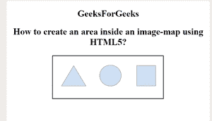
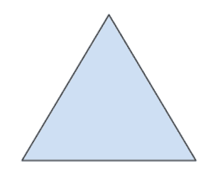

# 如何使用 HTML5 在图像地图中创建一个区域？

> 原文:[https://www . geeksforgeeks . org/如何使用 html5 创建图像地图内的区域/](https://www.geeksforgeeks.org/how-to-create-an-area-inside-an-image-map-using-html5/)

本文的方法是通过在 HTML 文档中使用 [**<【区域】>**](https://www.geeksforgeeks.org/html-area-tag/) 标签在图像地图内创建一个区域。它用于在用户点击图像的映射部分后，引导用户到不同的链接。用作<地图>标签的子标签。它没有结束标记，因此对于 HTML 来说它是一个空标记，但是在使用 XHTML 的情况下，您需要正确地关闭它。HTML5 有一些新的属性。

**语法:**

```html
<area> Contents </area> 
```

**示例:**

## 超文本标记语言

```html
<!DOCTYPE html>
<html>

<body style="text-align: center">
    <h2 style="color: green;">
        GeeksForGeeks
    </h2>
    <h2>
        How to create an area inside
        an image-map using HTML5?
    </h2>
    

    <map name="shapemap">

        <!-- Area tag contained image. -->
        <area shape="poly"
            coords="59, 31, 28, 83, 91, 83"
            href=
"https://media.geeksforgeeks.org/wp-content/uploads/20190227165802/area2.png"
            alt="Triangle">

        <area shape="circle"
            coords="155, 56, 26"
            href=
"https://media.geeksforgeeks.org/wp-content/uploads/20190227165934/area3.png"
            alt="Circle">

        <area shape="rect"
            coords="224, 30, 276, 82"
            href=
"https://media.geeksforgeeks.org/wp-content/uploads/20190227170021/area4.png"
            alt="Square">
    </map>
</body>

</html>
```

**输出:**

**点击具体可点击区域前:**



**点击具体可点击区域后:**



**支持的浏览器:**

*   谷歌 Chrome
*   微软公司出品的 web 浏览器
*   火狐浏览器
*   歌剧
*   旅行队