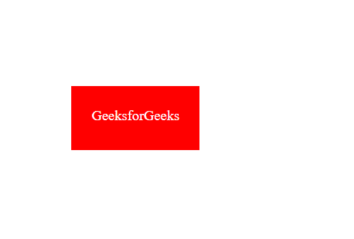

# 如何使用 HTML 和 CSS 创建改变按钮颜色的效果？

> 原文:[https://www . geeksforgeeks . org/如何使用 html 和 css 创建效果更改按钮颜色/](https://www.geeksforgeeks.org/how-to-create-an-effect-to-change-button-color-using-html-and-css/)

按钮的变色效果很常见，但我们要做的是这种效果的高级版本。背景会像剪辑效果一样以特定的角度旋转。

**手法:**手法是提供两三个背景，然后在不同的角度旋转。

**HTML 代码:**在本节中，我们将使用 HTML 代码来设计车身结构。

```html
<!DOCTYPE html>
<html lang="en">

<head>
    <meta charset="UTF-8" />
    <meta name="viewport" content=
        "width=device-width, initial-scale=1.0" />
    <title>Button effect</title>
</head>

<body>
    <a href="#">GeeksforGeeks</a>
</body>

</html>
```

**CSS 代码:**在本节中，我们将按照一些步骤来设计按钮效果。

*   **第一步:**首先，我们设置按钮的位置，然后使用文本修饰属性从链接中移除下划线。此外，设置按钮的宽度、高度、颜色和背景颜色。
*   **步骤 2:** 这里我们使用选择器之前的[旋转应用第二个背景。我们使用 z-index 在另一个的顶部显示这个背景。](https://www.geeksforgeeks.org/css-before-selector/)
*   **步骤 3:** 现在，在选择器之前，使用[悬停](https://www.geeksforgeeks.org/css-hover-selector/)和[的嵌套选择，以不同的旋转程度应用最终背景。](https://www.geeksforgeeks.org/css-before-selector/)

**提示:**可以根据需要改变旋转的度数来稍微改变一下效果。

下面是以上三个步骤的实现。

```html
<style>
    body {
        padding: 0;
        margin: 0;
    }

    a {
        position: absolute;
        top: 40%;
        left: 40%;
        transform: translate(-50%, -50%);
        width: 180px;
        height: 60px;
        color: white;
        text-decoration: none;
        text-align: center;
        padding-top: 30px;
        font-size: 20px;
        overflow: hidden;
        background: green;
    }

    a::before {
        content: "";
        position: absolute;
        width: 0;
        height: 0;
        left: 0;
        bottom: 0;
        border-style: solid;
        border-color: #f00;
        border-width: 80px 100px;
        z-index: -1;
        transform: rotate(360deg);
        transition: 1s;
        transform-origin: left;
    }

    a:hover::before {
        border-color: #00f;
        transform: rotate(60deg);
    }
</style>
```

**完整代码:**在本节中，我们将结合上面的 to 部分，使用 HTML 和 CSS 对按钮进行变色效果。

```html
<!DOCTYPE html>
<html lang="en">

<head>
    <meta charset="UTF-8" />
    <meta name="viewport" 
          content="width=device-width, initial-scale=1.0" />
    <title>Button effect</title>
    <style>
        body {
            padding: 0;
            margin: 0;
        }

        a {
            position: absolute;
            top: 40%;
            left: 40%;
            transform: translate(-50%, -50%);
            width: 180px;
            height: 60px;
            color: white;
            text-decoration: none;
            text-align: center;
            padding-top: 30px;
            font-size: 20px;
            overflow: hidden;
            background: green;
        }

        a::before {
            content: "";
            position: absolute;
            width: 0;
            height: 0;
            left: 0;
            bottom: 0;
            border-style: solid;
            border-color: #f00;
            border-width: 80px 100px;
            z-index: -1;
            transform: rotate(360deg);
            transition: 1s;
            transform-origin: left;
        }

        a:hover::before {
            border-color: #00f;
            transform: rotate(60deg);
        }
    </style>
</head>

<body>
    <a href="#">GeeksforGeeks</a>
</body>

</html>
```

**输出:**
