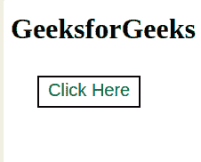
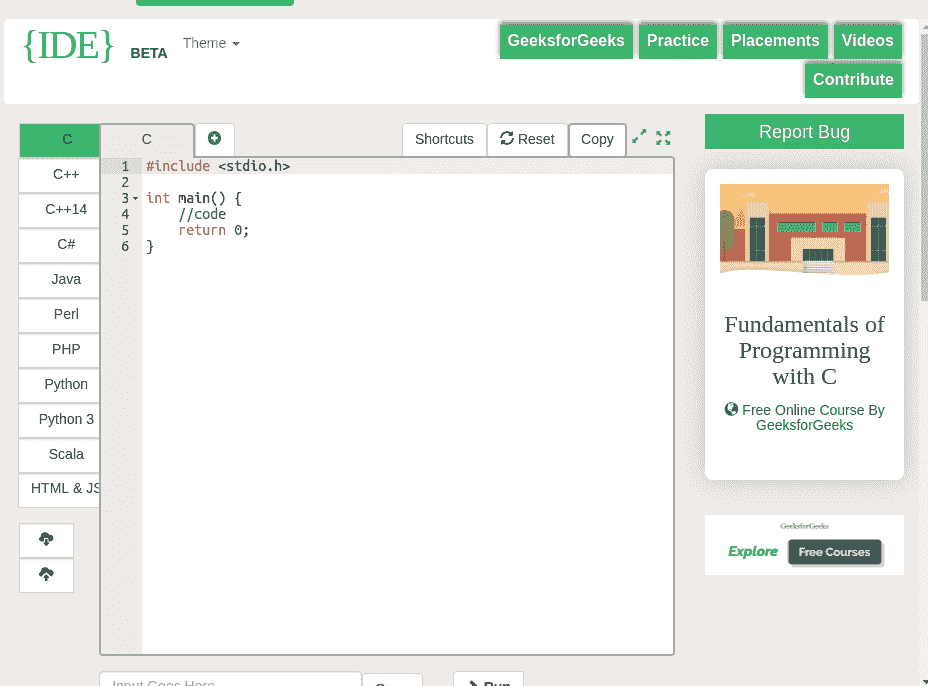

# 如何创建一个像链接一样的 HTML 按钮？

> 原文:[https://www . geeksforgeeks . org/如何创建一个类似链接的 html 按钮/](https://www.geeksforgeeks.org/how-to-create-an-html-button-that-acts-like-a-link/)

有几种方法可以创建一个作为链接的 HTML 按钮。下面讨论其中的一些:
**注意:**在每个方法中给按钮添加基本的 CSS 属性，让按钮看起来更好。

*   **使用 onclick 事件:**当用户点击按钮时，onclick 事件属性起作用。当鼠标点击按钮时，按钮就像一个链接，将页面重定向到给定的位置。

    ```html
    <!DOCTYPE html>
    <html>

    <head>
        <title>
            Create an HTML button that
            acts like a link
        </title>

        <!-- Style to create button -->
        <style>
            .GFG {
                background-color: white;
                border: 2px solid black;
                color: green;
                padding: 5px 10px;
                text-align: center;
                display: inline-block;
                font-size: 20px;
                margin: 10px 30px;
                cursor: pointer;
            }
        </style>
    </head>

    <body>
        <h1>GeeksforGeeks</h1>

        <!-- Adding link to the button on the onclick event -->
        <button class="GFG" 
        onclick="window.location.href = 'https://ide.geeksforgeeks.org';">
            Click Here
        </button>
    </body>

    </html>                    
    ```

*   **在<内使用按钮标签一个>标签:**这个方法在锚点标签内创建一个按钮。锚标签将网页重定向到给定的位置。

    ```html
    <!DOCTYPE html>
    <html>

    <head>
        <title>
            Create an HTML button that
            acts like a link
        </title>

        <!-- Style to create button -->
        <style>
            .GFG {
                background-color: white;
                border: 2px solid black;
                color: green;
                padding: 5px 10px;
                text-align: center;
                display: inline-block;
                font-size: 20px;
                margin: 10px 30px;
                cursor: pointer;
            }
        </style>
    </head>

    <body>
        <h1>GeeksforGeeks</h1>

        <!-- Adding button inside the link tag -->
        <a href='https://ide.geeksforgeeks.org/'>
            <button class="GFG">
                Click Here
            </button>
        </a>
    </body>

    </html>                    
    ```

*   **将样式作为按钮添加到链接中:**这个方法创建一个简单的锚点标签链接，然后应用一些 CSS 属性使它像一个按钮。

    ```html
    <!DOCTYPE html>
    <html>

    <head>
        <title>
            Create an HTML button that
            acts like a link
        </title>

        <!-- Style to create button -->
        <style>
            .GFG {
                background-color: white;
                border: 2px solid black;
                color: green;
                padding: 5px 10px;
                text-align: center;
                display: inline-block;
                font-size: 20px;
                margin: 10px 30px;
                cursor: pointer;
                text-decoration:none;
            }
        </style>
    </head>

    <body>
        <h1>GeeksforGeeks</h1>

        <!-- Create a normal link and add CSS property -->
        <a href="https://ide.geeksforgeeks.org/" class="GFG">
            Click here
        </a>
    </body>

    </html>                                   
    ```

*   **使用表单标签:**该方法使用表单标签和按钮标签。单击按钮后，将调用表单操作属性，并将网页重定向到给定位置。

    ```html
    <!DOCTYPE html>
    <html>

    <head>
        <title>
            Create an HTML button that
            acts like a link
        </title>

        <!-- Style to create button -->
        <style>
            .gfg {
            background-color: white;
            border: 2px solid black;
            color: green;
            padding: 5px 10px;
            text-align: center;
            display: inline-block;
            font-size: 20px;
            margin: 10px 30px;
            cursor: pointer;
            }
        </style>
    </head>

    <body>
        <h1>GeeksforGeeks</h1>

        <!-- Create a form then add button
            inside the form -->
        <form action="https://ide.geeksforgeeks.org/">
            <button class = "gfg" type="submit">
                Click Here
            </button>
        </form>
    </body>

    </html>                    
    ```

**注意:**每种方法的输出都是一样的。

**输出:**

*   **点击按钮前:**
    
*   **点击按钮后:**
    

HTML 是网页的基础，通过构建网站和网络应用程序用于网页开发。您可以通过以下 [HTML 教程](https://www.geeksforgeeks.org/html-tutorials/)和 [HTML 示例](https://www.geeksforgeeks.org/html-examples/)从头开始学习 HTML。