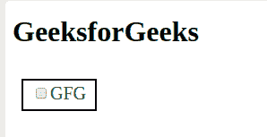

# 如何创建带有可点击标签的 HTML 复选框？

> 原文:[https://www . geesforgeks . org/如何创建带有可点击标签的 html 复选框/](https://www.geeksforgeeks.org/how-to-create-an-html-checkbox-with-a-clickable-label/)

制作一个带有**可点击标签**的 HTML 复选框意味着*当点击标签*时，复选框打开/关闭。

**下面是方法:**

*   **Using checkbox inside label tag:**

    ```html
    <!DOCTYPE html>
    <html>

    <head>
        <title>
            Create an HTML checkbox with a clickable label
        </title>

        <!-- Adding Style to label -->
        <style>
            .GFG {
                background-color: white;
                border: 2px solid black;
                color: green;
                padding: 5px 10px;
                text-align: center;
                display: inline-block;
                font-size: 20px;
                margin: 10px 10px;
                cursor: pointer;
            }
        </style>
    </head>

    <body>
        <h1>
          GeeksforGeeks
      </h1>

        <!-- Putting checkbox inside label tag -->
        <label class="GFG">
            <input type="checkbox" 
                   name="checkbox" 
                   value="Geeks">
          GFG
      </label>
    </body>

    </html>
    ```

    **输出:**
    **点击标签前:**
    

    **点击标签后:**
    

*   **Using the for attribute:** Create a checkbox using input tag then create a label for the created checkbox using the for attribute.

    ```html
    <!DOCTYPE html>
    <html>

    <head>
        <title>
            Create an HTML checkbox 
          with a clickable label
        </title>

        <!-- Adding Style to label -->
        <style>
            .GFG {
                background-color: white;
                border: 2px solid black;
                color: green;
                padding: 5px 10px;
                text-align: center;
                display: inline-block;
                font-size: 20px;
                margin: 10px 10px;
                cursor: pointer;
            }
        </style>
    </head>

    <body>
        <h1>GeeksforGeeks</h1>

        <!-- Using the for attribute in label -->
        <input type="checkbox"
               name="checkbox" 
               id="checkID"
               value="Geeks">
        <label class="GFG"
               for="checkID">
          GFG
      </label>
    </body>

    </html>
    ```

    **输出:**
    **点击标签前:**
    

    **点击标签后:**
    