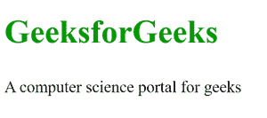

# 如何创建一个使用旁注元素的 HTML 文档？

> 原文:[https://www . geeksforgeeks . org/如何创建使用备用元素的 html 文档/](https://www.geeksforgeeks.org/how-to-create-an-html-document-which-uses-aside-element/)

<aside>标签用于像荧光笔一样，以较短的方式描述网页的主要对象。它基本上识别与网页的主要内容相关的内容，但不构成主要页面的主要意图。

<aside>标签主要包含作者信息、链接、相关内容等。</aside>

</aside>

<aside>标签使页面设计变得容易，并且增强了 HTML 文档的清晰度。它让我们很容易识别主文本和从属文本。在和

<aside>都需要 CSS 来具体设计。

<aside>标签支持 HTML 中的全局属性和事件属性。</aside>

</aside>

</aside>

**语法:**

```html
<aside>
    <h3>Contents...</h3>
    <p>Contents...</p>
</aside>

```

**例 1:**

## 超文本标记语言

```html
<!DOCTYPE html>
<html>

<head>
    <style>
        h1 {
            font-size: 40px;
            color: #090;
            font-weight: bold;
        }

        p {
            font-size: 20px;
            margin: 20px 0;
        }
    </style>
</head>

<body>
    <aside>
        <h1>GeeksforGeeks</h1>

<p>A computer science portal for geeks</p>

    </aside>
</body>

</html>
```

**输出:**



**例 2:**

## 超文本标记语言

```html
<!DOCTYPE html>
<html>

<head>
    <style>
        .gfg {
            font-size: 40px;
            color: #090;
            font-weight: bold;
            text-align: center;
            margin-bottom: 20px;
        }

        article {
            width: 50%;
            float: left;
            padding: 10px;
            float: left;
        }

        aside {
            float: right;
            width: 40%;
            float: right;
            background-color: green;
            color: white;
            padding: 5px;
            margin: 10px;
            height: 100px;
        }
    </style>
</head>

<body>
    <div class="gfg">
        GeeksforGeeks
    </div>

    <article>
        <h1>Article Title</h1>

<p>
            Aside tag is use to display
            important information
            about the primary page.
        </p>

    </article>

    <aside>
        <h1>Aside Tag Example</h1>

<p>Aside tag content. . .</p>

    </aside>
</body>

</html>
```

**输出:**

