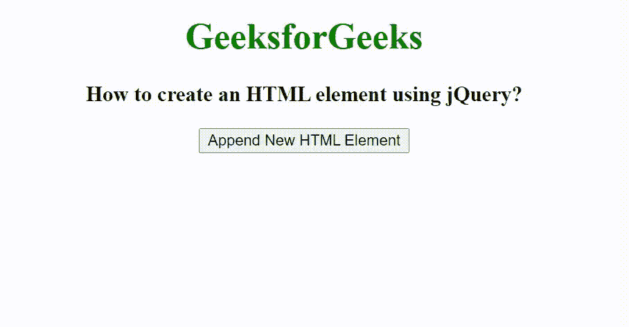

# 如何使用 jQuery 创建 HTML 元素？

> 原文:[https://www . geeksforgeeks . org/如何使用-jquery/](https://www.geeksforgeeks.org/how-to-create-an-html-element-using-jquery/) 创建 html 元素

在本文中，我们将看到如何使用 jQuery 创建一个 HTML 元素。为了创建和追加 HTML 元素，我们使用 [jQuery append()](https://www.geeksforgeeks.org/jquery-append-method/) 方法。

jQuery append()方法用于在所选元素的末尾插入一些内容。

**语法:**

```html
$(selector).append( content, function(index, html) )
```

**参数:**

*   **内容:**必选参数，用于指定要插入到所选元素末尾的内容。内容的可能值是 HTML 元素、jQuery 对象和 DOM 元素。
*   **函数(index，html):** 为可选参数，用于指定将返回待插入内容的函数。
    *   **索引:**用于返回元素的索引位置。
    *   **html:** 用于返回选中元素的当前 html。

**示例:**

## 超文本标记语言

```html
<!DOCTYPE html>
<html>

<head>
    <title>
        How to create an HTML element using jQuery?
    </title>

    <script src="
https://ajax.googleapis.com/ajax/libs/jquery/3.3.1/jquery.min.js">
    </script>

    <!-- Script to add div element in the HTML document -->
    <script>
        $(document).ready(function() {

            $("button").click(function() {
                $(".append").append(
'<div class="added">New HTML element added</div>');
            });
        });
    </script>

    <!-- Style to use on div element -->
    <style>
        .added {
            padding: 20px;
            margin-top: 20px;
            background: green;
            color: white;
            display: inline-block;
        }
    </style>
</head>

<body>
    <center>
        <h1 style="color: green;">GeeksforGeeks</h1>

        <h3>
            How to create an HTML element using jQuery?
        </h3>

        <button id="append">Append New HTML Element</button>

        <div class="append"></div>
    </center>
</body>

</html>
```

**输出:**

