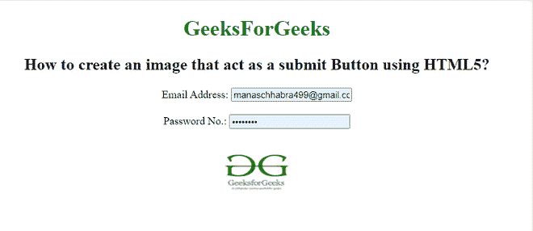

# 如何用 HTML5 创建一个充当提交按钮的图像？

> 原文:[https://www . geesforgeks . org/如何使用 html5 创建图像-充当提交按钮/](https://www.geeksforgeeks.org/how-to-create-an-image-acting-as-a-submit-button-using-html5/)

在本文中，我们将学习如何创建一个充当提交按钮的图像，即每当我们单击表单中的图像时，它都会自动提交给服务器。<input>类型属性的默认类型是文本。在这里，我们用简单的方法完成任务。

**语法**

```html
<input type = "image">
```

**属性值:**

*   **图像:**用于定义图像为提交按钮。

**特征:**

*   输入元素不接受*值*属性。
*   图像路径在 *src* 属性中定义。
*   输入元素由各种常见属性支持。

**进场:**

*   首先，创建一个包含<input>标签的 HTML 文档。
*   使用**类型的**属性和<输入>标签。
*   将类型属性设置为值“**图像**”。
*   您也可以使用包含图像网址的 **src** 属性。

**示例:**该示例说明了在输入类型中使用图像按钮以 HTML 表单提交登录详细信息。

## 超文本标记语言

```html
<!DOCTYPE html>
<html>

<body style="text-align: center">
    <h1 style="color: green">
        GeeksForGeeks
    </h1>

    <h2>
        How to create an image that act 
        as a submit Button using HTML5?
    </h2>

    <form>
        Email Address:
        <input type="email" 
            placeholder="Enter your email Address" />
        <br><br>

        Password No.:
        <input type="password" 
            placeholder="Enter password " />
        <br><br>

        <input type="image" src=
"https://media.geeksforgeeks.org/wp-content/uploads/20210915115837/gfg3.png"
            height="80px" width="110px" 
            alt="submit" />
    </form>
</body>

</html>
```

**输出:**



**示例:**在本例中，我们使用输入类型作为 HTML 中简讯订阅按钮的图像。

## 超文本标记语言

```html
<!DOCTYPE html>
<html>

<body style="text-align: center">
    <h1 style="color: green">
        GeeksforGeeks
    </h1>

    <h4>Subscribe to GeeksforGeeks Newsletter</h4>

    <p>
        The best of content served at the 
        convenience of your fingertips.
    </p>

    <form>
        Name:
        <input type="text" placeholder="Name"
                name="name" required />
        <br><br>

        Email:
        <input type="text" placeholder="Email address"
                name="mail" required />
        <br><br>

        <input type="checkbox" checked="checked"
                name="subscribe" />
        Daily Newsletter

        <br><br>
        <input type="image" src=
"https://media.geeksforgeeks.org/wp-content/uploads/20210915115837/gfg3.png"
            height="80px" width="90px" 
            value="Subscribe" />
    </form>
</body>

</html>
```

**输出:**

