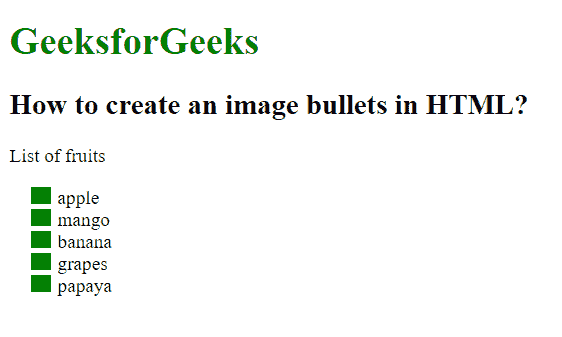

# 如何在 HTML 中创建图像项目符号？

> 原文:[https://www . geesforgeks . org/如何创建 html 格式的图像项目符号/](https://www.geeksforgeeks.org/how-to-create-an-image-bullets-in-html/)

在本文中，我们给出了一些列表项，任务是创建一个带有图像项目符号的列表项。这个任务可以通过使用 CSS 中的[**列表样式-图像** **属性**](https://www.geeksforgeeks.org/css-list-style-image-property/) 来完成。此属性用于设置将用作列表项标记的图像。

**语法:**

```html
list-style-image: url; 
```

**示例:下面的代码说明了如何使用 css 创建图像项目符号。**

## 超文本标记语言

```html
<!DOCTYPE html>
<html>

<head>
    <title>
        How to create an image bullets in HTML?
    </title>

    <style>
        ul {
            list-style-image: url(
"https://contribute.geeksforgeeks.org/wp-content/uploads/listitem-1.png");
        }
    </style>
</head>

<body>
    <h1 style="color:green;">
        GeeksforGeeks
    </h1>

    <h2>
        How to create an image bullets in HTML?
    </h2>

<p>List of fruits</p>

    <ul>
        <li>apple</li>
        <li>mango</li>
        <li>banana</li>
        <li>grapes</li>
        <li>papaya</li>
    </ul>
</body>

</html>
```

**输出**



**支持的浏览器如下:**

*   谷歌 Chrome
*   微软公司出品的 web 浏览器
*   火狐浏览器
*   旅行队
*   歌剧