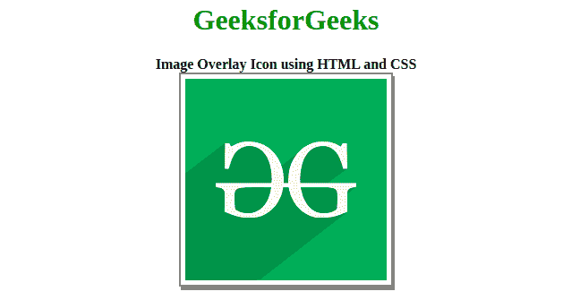
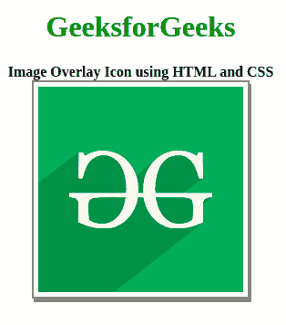

# 如何使用 HTML 和 CSS 创建图像叠加图标？

> 原文:[https://www . geesforgeks . org/如何使用 html 和 css 创建图像覆盖图标/](https://www.geeksforgeeks.org/how-to-create-an-image-overlay-icon-using-html-and-css/)



图像叠加图标可以给你的网站增加令人印象深刻的互动细节或一系列功能。本文内容将任务分为两部分，第一部分创建结构并为图标附加链接。在第二部分，我们将使用 CSS 设计结构。

**创建结构:**在本节中，我们将创建一个基本结构，并为将在悬停时用作图标的图标附加字体-Awesome 的 CDN 链接。

*   **字体中图标的 CDN 链接令人敬畏:**

    > <link rel="”stylesheet”" href="“https://cdnjs.cloudflare.com/ajax/libs/font-awesome/4.7.0/css/font-awesome.min.css”">

*   **HTML 代码:**

    ```html
    <!DOCTYPE html>
    <html>

    <head>
        <title>
            Image Overlay Icon using HTML and CSS 
        </title>
        <link rel="stylesheet" href= 
    "https://cdnjs.cloudflare.com/ajax/libs/font-awesome/4.7.0/css/font-awesome.min.css">
    </head>
    <body>
        <div class="container">
            <h1>GeeksforGeeks</h1>
            <b>Image Overlay Icon using HTML and CSS</b>
            <div class="img">
                
                <div class="overlay">
                    <a href="#" class="icon">
                       <i class="fa fa-user"></i>
                    </a>
                </div>
            </div>
        </div>
    </body>

    </html>
    ```

**设计结构:**在上一节中，我们已经创建了基本网站的结构，我们将在其中用作图像叠加图标。在本节中，我们将设计图像覆盖图标的结构。

*   **CSS 代码:**

    ```html
    <style>
        body {
            text-align: center;
        }

        h1 {
            color: green;
        }

        /* Image styling */
        img {
            padding: 5px;
            height: 225px;
            width: 225px;
            border: 2px solid gray;
            box-shadow: 2px 4px #888888;

        }

        /* Overlay styling */
        .overlay {
            position: absolute;
            top: 23.5%;
            left: 32.8%;
            transition: .3s ease;
            background-color: gray;
            width: 225px;
            height: 225px;
            opacity: 0;

        }

        /* Overlay hover */
        .container:hover .overlay {
            opacity: 1;
        }

        /* Icon styling */
        .icon {
            color: white;
            font-size: 92px;
            position: absolute;
            top: 50%;
            left: 50%;
            transform: translate(-50%, -50%);
            text-align: center;
        }
    </style>
    ```

**最终解决方案:**这是合并以上两部分后的最终代码。它将显示图像覆盖图标。

```html
<!DOCTYPE html>
<html>

<head>
    <title>
        Image Overlay Icon using HTML and CSS 
    </title>
    <link rel="stylesheet" href= 
"https://cdnjs.cloudflare.com/ajax/libs/font-awesome/4.7.0/css/font-awesome.min.css">
    <style>
        body {
            text-align: center;
        }

        h1 {
            color: green;
        }

        /* Image styling */
        img {
            padding: 5px;
            height: 225px;
            width: 225px;
            border: 2px solid gray;
            box-shadow: 2px 4px #888888;
        }

        /* Overlay styling */
        .overlay {
            position: absolute;
            top: 23.5%;
            left: 32.8%;
            transition: .3s ease;
            background-color: gray;
            width: 225px;
            height: 225px;
            opacity: 0;
        }

        /* Overlay hover */
        .container:hover .overlay {
            opacity: 1;
        }

        /* Icon styling */
        .icon {
            color: white;
            font-size: 92px;
            position: absolute;
            top: 50%;
            left: 50%;
            transform: translate(-50%, -50%);
            text-align: center;
        }
    </style>
</head>

<body>
    <div class="container">
        <h1>GeeksforGeeks</h1>
        <b>Image Overlay Icon using HTML and CSS</b>
        <div class="img">
            
            <div class="overlay">
                <a href="#" class="icon">
                   <i class="fa fa-user"></i>
                </a>
            </div>
        </div>
    </div>
</body>

</html>
```

**输出:** 