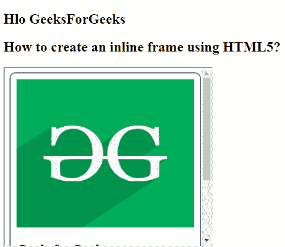

# 如何使用 HTML5 创建内嵌框架？

> 原文:[https://www . geeksforgeeks . org/如何使用-html5 创建内联框架/](https://www.geeksforgeeks.org/how-to-create-an-inline-frame-using-html5/)

在本文中，我们将通过在文档中使用 **[< iframe >标签](https://www.geeksforgeeks.org/html-iframes/)** 来创建内嵌 iframe。
它代表文档中的一个固定矩形区域，浏览器可以在其中显示单独的文档以及滚动条和边框。内嵌框架用于在当前的 HTML 页面中嵌入另一个文档。
**语法:**

```html
<iframe src="URL"></iframe>
```

**示例:**

```html
<!DOCTYPE html>
<html>

<head>
    <title>
        How to create an inline 
        frame using HTML5?
    </title>
</head>

<body>
    <h2>Hlo GeeksForGeeks</h2>

    <h2>
        How to create an inline 
        frame using HTML5?
    </h2>

    <p>Content goes here</p>

    <iframe src=
"https://ide.geeksforgeeks.org/tryit.php" 
        height="300" width="400">
    </iframe>

</body>

</html> 
```

**输出:**


**例 2:**

```html
<!DOCTYPE html>
<html>

<head>
    <title>
        How to create an inline 
        frame using HTML5?
    </title>
</head>

<body>
    <h2>Hlo GeeksForGeeks</h2>

    <h2>
        How to create an inline 
        frame using HTML5?
    </h2>

    <iframe height="300" width="350"
        src="
https://media.geeksforgeeks.org/wp-content/cdn-uploads/20190717121605/Screenshot-from-2019-07-17-12-12-55.png"
        name="iframe_a"></iframe>

</body>

</html>
```

**输出:**


**支持的浏览器如下:**

*   谷歌 Chrome
*   微软公司出品的 web 浏览器
*   火狐浏览器
*   歌剧
*   旅行队